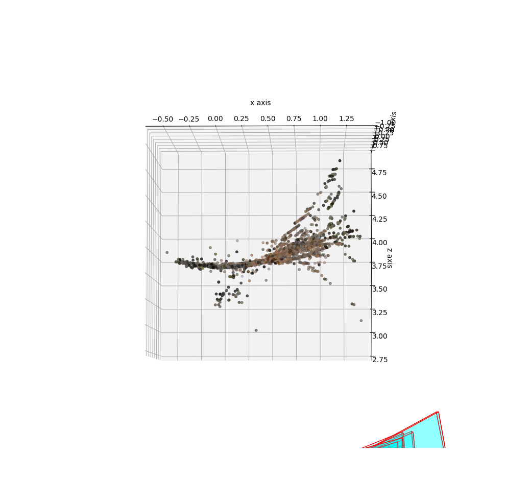
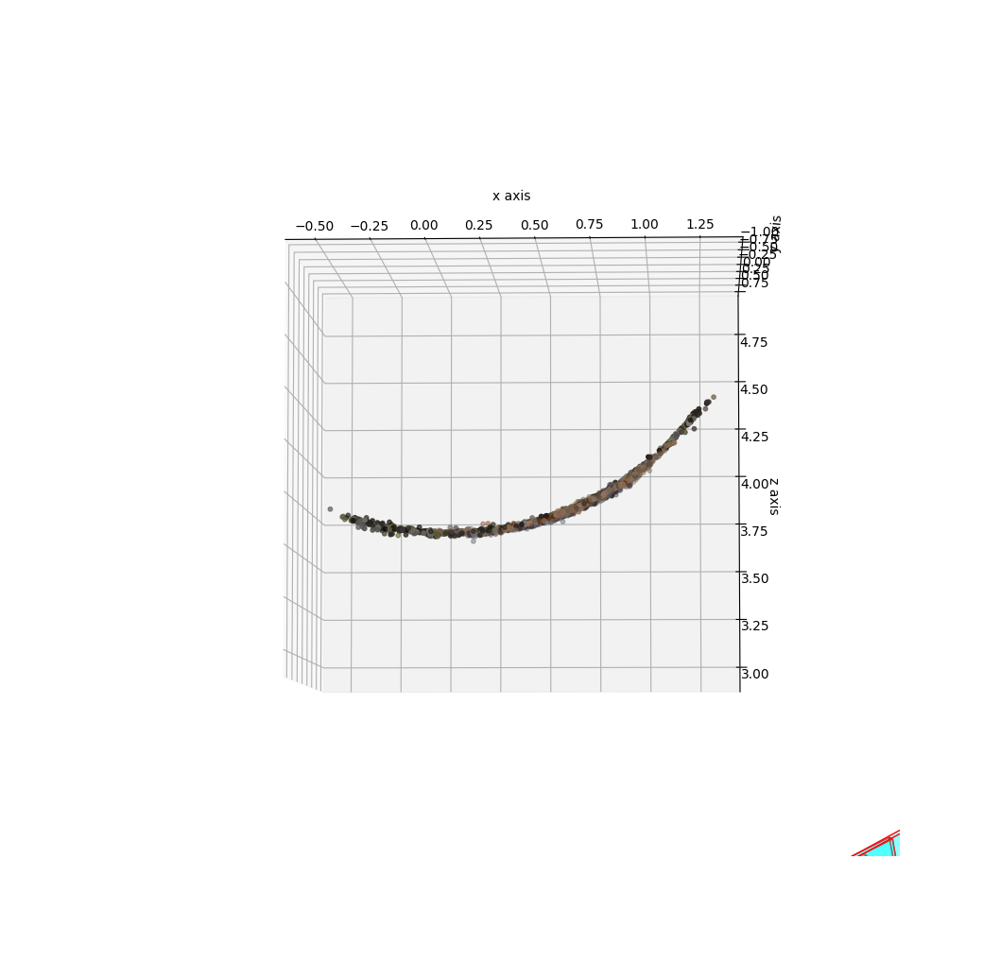
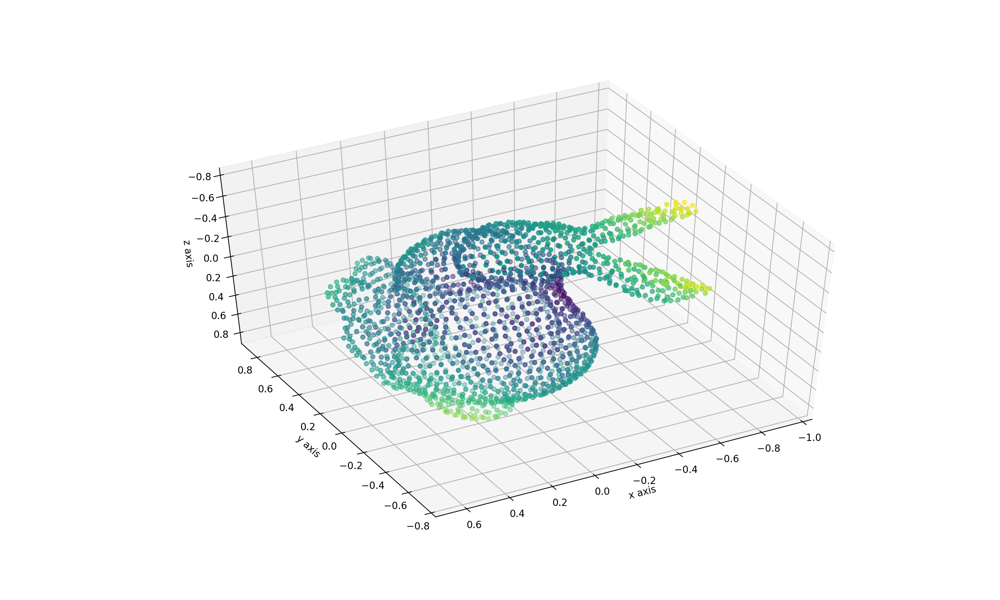
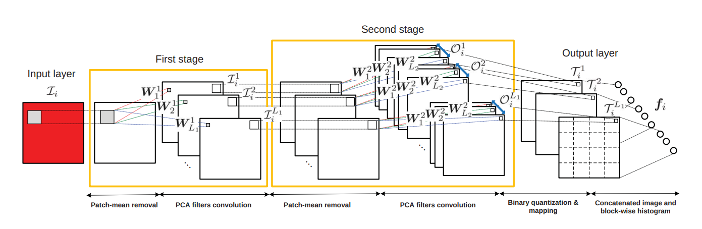
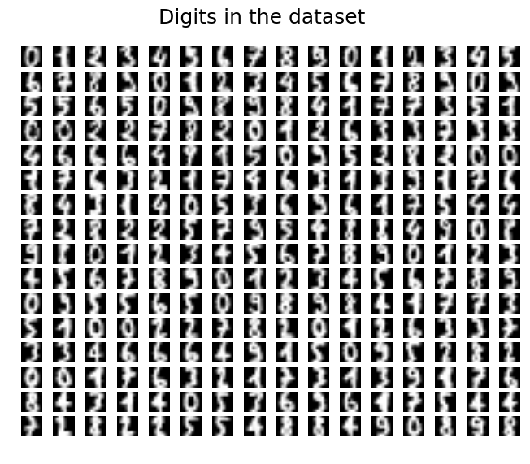
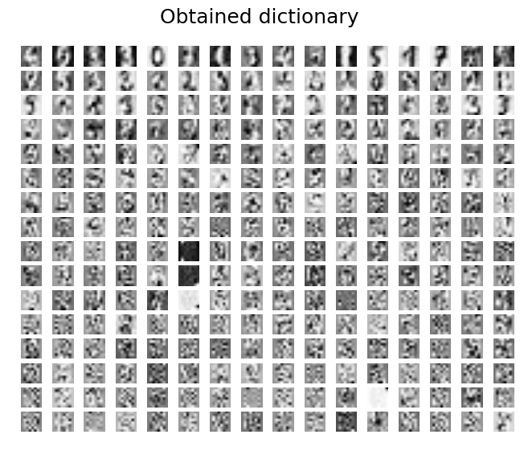
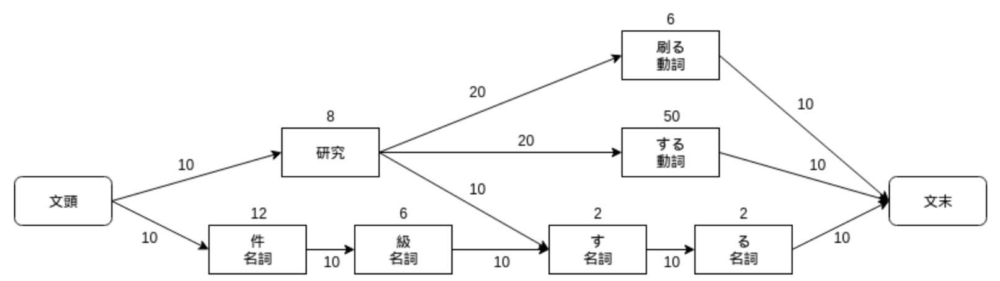

=========
石田 岳志
=========

職歴
====

| `Tier IV, Inc. <https://tier4.jp/>`__
| 車両の自己位置推定の研究開発
| 2020年7月 - 現在

| `未踏プロジェクト <https://www.ipa.go.jp/jinzai/mitou/2019/gaiyou_s-2.html>`__
| Visual SLAMフレームワークの開発
| 2019年4月 - 2020年3月

| `株式会社ディー・エヌ・エー <https://dena.com/>`__
| コンピュータビジョンに関連する手法の調査と実装
| 2018年4月 - 2020年3月
| アルバイト

| `クックパッド株式会社 <https://info.cookpad.com>`__
| 料理画像から具材を推定する手法の開発
| 2016年12月 - 2017年7月
| アルバイト

| `株式会社ウサギィ <http://usagee.co.jp/>`__
| コンピュータビジョンや自然言語処理におけるさまざまな手法の調査と実装
| 2014年5月 - 2017年1月
| アルバイト

学歴
====

| 東京高専 専攻科 機械情報システム工学専攻
| 2017年4月 - 2019年3月

| フィンランド メトロポリア応用科学大学 (交換留学)
| 2017年8月 - 2017年12月

| 東京高専 情報工学科
| 2012年4月 - 2017年3月

特許
====

`特許6306770 <https://www.j-platpat.inpit.go.jp/web/PU/JPB_6306770/062D067C8381CD29700292EC1ED536D9>`__.

料理画像に写っている料理に用いられている具材を料理画像から推定する手法

リンク
======

- `GitHub       <https://github.com/IshitaTakeshi>`__
- `Blog         <https://ishitatakeshi.netlify.com>`__
- `Qiita        <https://qiita.com/IshitaTakeshi>`__
- `SpeakerDeck  <https://speakerdeck.com/ishitatakeshi>`__

成果物
======

`Tadataka <https://github.com/IshitaTakeshi/Tadataka>`__
--------------------------------------------------------

| Visual SLAMフレームワークとして途中まで開発した。
| 現在では RGB-D ベースのオドメトリ推定アルゴリズム(DVO)と、特徴点ベースのVisual Odometryを使うことができる。

**DVO (Dense Visual Odometry)** [#Steinbrucker_et_al_2011]_ [#Kerl_et_al_2013]_

| 深度情報および画像の輝度情報からカメラの移動経路を推定することができる。

.. raw:: html

    <iframe width="560" height="315" src="https://www.youtube.com/embed/oDgBgdHUwOM" frameborder="0" allow="accelerometer; autoplay; encrypted-media; gyroscope; picture-in-picture" allowfullscreen></iframe>

**特徴点ベースのVisual Odometry**

| 単眼RGB画像列のみから3次元地図とカメラの軌跡を推定することができる.

.. raw:: html

    <iframe width="560" height="315" src="https://www.youtube.com/embed/h4KrMJQDoX4" frameborder="0" allow="accelerometer; autoplay; encrypted-media; gyroscope; picture-in-picture" allowfullscreen></iframe>

`RoadDamageDetector <https://github.com/IshitaTakeshi/RoadDamageDetector>`__
-------------------------------------------------------------------------------

.. image:: images/road-damage-1.png
    :width: 800

| SSD (Single Shot Multibox Detector) [#Liu_et_al_2016]_ によって道路のひび割れや損傷を検出することができる。
| 詳細な解説は `Qiita <https://qiita.com/IshitaTakeshi/items/915de731d8081e711ae5>`__ に掲載されている。

`SBA <https://github.com/IshitaTakeshi/SBA>`__
-----------------------------------------------

| 3次元復元における重要な最適化アルゴリズム Sparse Bundle Adjustment (SBA) [#Lourakis_et_al_2009]_ を実装した。
| 図は円筒の復元結果を表している。1枚目が SBA を適用せずに復元した結果であり、2枚目が SBA を適用しながら復元した結果である。左側は完全に地図が破綻しているのに対して右側は弧が正しく復元できていることがわかる。

`Tomasi-Kanade <https://github.com/IshitaTakeshi/Tomasi-Kanade>`__
------------------------------------------------------------------

| Tomasi-Kanade 法 [#Tomasi_et_al_1992]_ による3次元復元を Python で実装した。

`Bilinear-Interpolation-SIMD <https://github.com/IshitaTakeshi/Bilinear-Interpolation-SIMD>`__
----------------------------------------------------------------------------------------------

| 画像の画素補間に用いられるアルゴリズム Bilinear Interpolation を SIMD を用いて実装した。
| コンパイラが高度な最適化を行うため、実行速度は SIMD 版と普通にC言語で実装した場合とで変化がなかったが、SIMD を用いて計算を実装するよい練習になった。

`PCANet <https://github.com/IshitaTakeshi/PCANet>`__
-------------------------------------------------------

| PCANet [#Chan_et_al_2015]_ は重みを PCA によって計算することで高速にバッチ学習できるニューラルネットワークである。
| これを Python で実装する過程において、Pooling 層で必要となるヒストグラム計算に計算時間がかかってしまうことに気づいた。
| 私はヒストグラム計算を GPU 向けに実装し、ニューラルネットワークの汎用計算ライブラリである CuPy に Pull request を送った。
| CuPy開発者の方々の協力もあり、これは後にマージされている。 `#298 <https://github.com/cupy/cupy/pull/298>`__

`Ensemble PCANet <https://github.com/IshitaTakeshi/PCANet/tree/ensemble>`__
---------------------------------------------------------------------------

| PCANet をアンサンブル学習することで、少ない学習時間で分類器の性能向上を図った。
| 研究成果を2017年の人工知能学会で発表した。 `JSAI 2017 <https://www.ai-gakkai.or.jp/jsai2017/webprogram/2017/paper-504.html>`__

`K-SVD <https://github.com/IshitaTakeshi/KSVD.jl>`__
----------------------------------------------------

    文字画像の集合 (入力)

    得られた辞書

| K-SVD [#Aharon_et_al_2006]_ はスパースコーディングにおける辞書を生成するアルゴリズムである。
| 図は、手書き文字画像を入力信号とみなし、それを効率よく表現するための線形基底(辞書)が得られていることを表している。

`KanaKanjiConversion <https://github.com/IshitaTakeshi/KanaKanjiConversion>`__
------------------------------------------------------------------------------

| D言語で日本語入力システム(IME)を途中まで作った。
| 「単語の共起情報を利用したかな漢字変換システム」というテーマで2016年度の未踏プロジェクトに応募した(不採用)。当時の応募資料などは `Qiita <https://qiita.com/IshitaTakeshi/items/f2fbaee7ae48644e679e>`__ で公開されている。

`DTrie <https://github.com/IshitaTakeshi/dtrie>`__
--------------------------------------------------
| 簡潔データ構造「トライ」のD言語による実装
| かな漢字変換の辞書を少ないメモリで保持するために実装した。

`SCW <https://github.com/IshitaTakeshi/SCW>`__
-------------------------------------------------
| オンライン教師あり分類器である SCW (Soft Confidence-Weighted Learning) の実装 [#Wang_et_al_2012]_.

ブログ
======

- `プログラマが持つべき心構え (The Zen of Python) <https://qiita.com/IshitaTakeshi/items/e4145921c8dbf7ba57ef>`__
- `カルマンフィルタってなに？ <https://qiita.com/IshitaTakeshi/items/740ac7e9b549eee4cc04>`__
- `Tomasi-Kanade法による3次元復元 <https://qiita.com/IshitaTakeshi/items/297331b3878e72c65276>`__

執筆
====

- `日経ソフトウエア 2017年8月号 「Pythonで機械学習」 <https://shop.nikkeibp.co.jp/front/commodity/0000/SW1231/>`__
- `日経ソフトウエア 2020年5月号 「撮影した物体を3次元データで復元」 <https://shop.nikkeibp.co.jp/front/commodity/0000/SW1248/>`__

発表資料
=============

- `Graph SLAM の Marginalization <https://drive.google.com/file/d/1PxPDX3rvSvlKhNZMtHt2xWiYyDU44WSj/view?pli=1>`__
- `Sparse Bundle Adjustment <https://speakerdeck.com/ishitatakeshi/sparse-bundle-adjustment>`__
- `3次元回転表現とその実装 <https://speakerdeck.com/ishitatakeshi/3d-rotation-representation-and-its-implementation>`__
- `CUDAでヒストグラム計算を書いてcupyにmergeしてもらった <https://speakerdeck.com/ishitatakeshi/cudadehisutoguramuji-suan-woshu-itecupynimergesitemoratuta-1>`__
- `Juliaでオンライン線形分類器つくった <https://www.slideshare.net/TakeshiIshita/julia-56356347>`__
- `マルウェア分類に用いられる特徴量 Kaggle - Malware Classification Challenge勉強会 <https://www.slideshare.net/TakeshiIshita/kaggle-malware-classification-challenge>`__

References
==========

.. [#Aharon_et_al_2006] Aharon, Michal, Michael Elad, and Alfred Bruckstein. "K-SVD: An algorithm for designing overcomplete dictionaries for sparse representation." IEEE Transactions on signal processing 54.11 (2006): 4311-4322.
.. [#Chan_et_al_2015] Chan, Tsung-Han, et al. "PCANet: A simple deep learning baseline for image classification?." IEEE transactions on image processing 24.12 (2015): 5017-5032.
.. [#Kerl_et_al_2013] Kerl, Christian, Jürgen Sturm, and Daniel Cremers. "Robust odometry estimation for RGB-D cameras." Robotics and Automation (ICRA), 2013 IEEE International Conference on. IEEE, 2013.
.. [#Liu_et_al_2016] Liu, Wei, et al. "Ssd: Single shot multibox detector." Computer Vision–ECCV 2016: 14th European Conference, Amsterdam, The Netherlands, October 11–14, 2016, Proceedings, Part I 14. Springer International Publishing, 2016.
.. [#Lourakis_et_al_2009] Lourakis, Manolis IA, and Antonis A. Argyros. "SBA: A software package for generic sparse bundle adjustment." ACM Transactions on Mathematical Software (TOMS) 36.1 (2009): 1-30.
.. [#Steinbrucker_et_al_2011] Steinbrücker Frank, Jürgen Sturm, and Daniel Cremers. "Real-time visual odometry from dense RGB-D images." Computer Vision Workshops (ICCV Workshops), 2011 IEEE International Conference on. IEEE, 2011.
.. [#Tomasi_et_al_1992] Tomasi, Carlo, and Takeo Kanade. "Shape and motion from image streams under orthography: a factorization method." International journal of computer vision 9 (1992): 137-154.
.. [#Maeda_et_al_2018] Maeda, Hiroya, et al. "Road damage detection using deep neural networks with images captured through a smartphone." arXiv preprint arXiv:1801.09454 (2018).
.. [#Wang_et_al_2012] Wang, Jialei, Peilin Zhao, and Steven CH Hoi. "Exact soft confidence-weighted learning." arXiv preprint arXiv:1206.4612 (2012).
