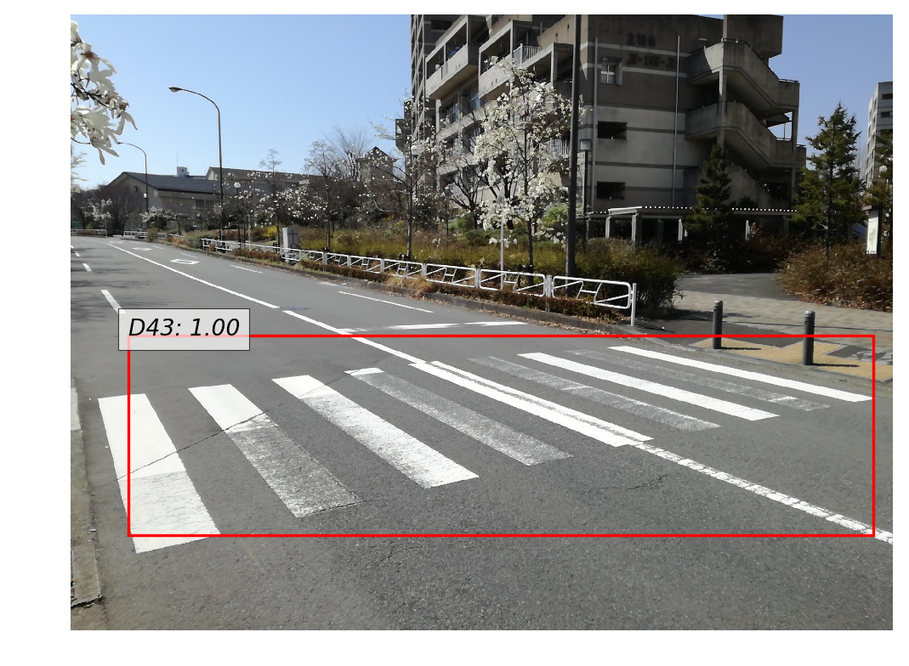

==============
Takeshi Ishita
==============

Work Experience
===============

`Tier IV, Inc. <https://tier4.jp/>`__
---------------------------------------------------------------------------

R&D of vehicle localization

| July 2020 - Present

`Mitou Program <https://www.ipa.go.jp/jinzai/mitou/2019/gaiyou_s-2.html>`__
---------------------------------------------------------------------------

Development of a Visual SLAM framework

| April 2019 - March 2020

`DeNA Co., Ltd. <https://dena.com/>`__
--------------------------------------

| April 2018 - March 2020
| Part-time job

`Cookpad Inc. <https://info.cookpad.com/en>`__
----------------------------------------------

Design and implementation of machine learning methods for ingredient recognition from food images.

Patent
~~~~~~

The model I proposed is granted as a patent
`#6306770 <https://www.j-platpat.inpit.go.jp/web/PU/JPB_6306770/062D067C8381CD29700292EC1ED536D9>`__.

| Dec 2016 - Jul 2017
| Part-time job

`Usagee Inc. <http://usagee.co.jp/>`__
--------------------------------------

-  Research and development of Machine Learinng & Computer Vision methods
-  Providing effective solutions to customers

| May 2014 - Jan 2017
| Part-time job

Education
=========

| National Institute of Technology, Tokyo College, Advanced Course
| April 2017 - March 2019

| Student exchange with Metropolia University of Applied Sciences
| August 2017 - December 2017

| National Institute of Technology, Tokyo College
| April 2012 - March 2017

My works
========

My works are available on `GitHub <https://github.com/IshitaTakeshi>`__

1. `Tadataka (under development) <https://github.com/IshitaTakeshi/Tadataka>`__
-------------------------------------------------------------------------------

This project aims to develop a Visual SLAM framework that is flexible and simple to use.

Currently implemented algorithms:

DVO (Dense Visual Odometry) [#Steinbrucker_et_al_2011]_ [#Kerl_et_al_2013]_
~~~~~~~~~~~~~~~~~~~~~~~~~~~~~~~~~~~~~~~~~~~~~~~~~~~~~~~~~~~~~~~~~~~~~~~~~~~

Estimating camera motion from RGB-D video sequence (`YouTube video <https://youtu.be/oDgBgdHUwOM>`__).

.. raw:: html

    <iframe width="560" height="315" src="https://www.youtube.com/embed/oDgBgdHUwOM" frameborder="0" allow="accelerometer; autoplay; encrypted-media; gyroscope; picture-in-picture" allowfullscreen></iframe>

Feature Based Visual Odometry
~~~~~~~~~~~~~~~~~~~~~~~~~~~~~

Estimating camera motion and 3D structure from a single RGB camera (`YouTube video <https://youtu.be/h4KrMJQDoX4>`__).

.. raw:: html

    <iframe width="560" height="315" src="https://www.youtube.com/embed/h4KrMJQDoX4" frameborder="0" allow="accelerometer; autoplay; encrypted-media; gyroscope; picture-in-picture" allowfullscreen></iframe>

2. `RoadDamageDetector <https://github.com/IshitaTakeshi/RoadDamageDetector>`__
-------------------------------------------------------------------------------

| Road damage detector based on SSD (Single Shot Multibox Detector).
| The detailed explanation is at `my Qiita blog page (in Japanese) <https://qiita.com/IshitaTakeshi/items/915de731d8081e711ae5>`__.
| Trained models are published along with the source code.

What I did
~~~~~~~~~~

-  Trained SSD(VGG16) on the RoadDamageDataset provided by Maeda et al. (2018) [#Maeda_et_al_2018]_
-  Replaced VGG16 with ResNet-101 and evaluated the performance

3. `PCANet <https://github.com/IshitaTakeshi/PCANet>`__
-------------------------------------------------------

| PCANet is a neural network for image classification that trains its weights with PCA [#Chan_et_al_2015]_.
| PCANet requires histogram calculation in the pooling layer. Although there was no GPU support for histogram calculation in CuPy.
| I implemented the histogram calculation in CUDA and sent a pull request, which has been merged into the CuPy repository.
  `#298 <https://github.com/cupy/cupy/pull/298>`__

`Ensemble PCANet <https://github.com/IshitaTakeshi/PCANet/tree/ensemble>`__
~~~~~~~~~~~~~~~~~~~~~~~~~~~~~~~~~~~~~~~~~~~~~~~~~~~~~~~~~~~~~~~~~~~~~~~~~~~

| PCANet can train quickly. On the other hand, its representation ability is not strong.
| I combined PCANet with Bagging and succeeded to increase the representation ability while keeping the training speed.
| This idea is proposed to `JSAI 2017 <https://www.ai-gakkai.or.jp/jsai2017/webprogram/2017/paper-504.html>`__.

4. `SCW <https://github.com/IshitaTakeshi/SCW>`__
-------------------------------------------------
| Implementation of SCW (Soft Confidence-Weighted Learning) [#Wang_et_al_2012]_.
| SCW is an online supervised learning algorithm which utilizes all the four salient properties:

- Large margin training
- Confidence weighting
- Capability to handle non-separable data
- Adaptive margin

Blog
====
- `The Zen of Python <https://qiita.com/IshitaTakeshi/items/e4145921c8dbf7ba57ef>`__
- `Kalman Filter <https://qiita.com/IshitaTakeshi/items/740ac7e9b549eee4cc04>`__
- `Tomasi-Kanade 3D reconstruction <https://qiita.com/IshitaTakeshi/items/297331b3878e72c65276>`__

Article
=======

- `日経ソフトウエア 2017年8月号 「Pythonで機械学習」 <https://shop.nikkeibp.co.jp/front/commodity/0000/SW1231/>`__
- `日経ソフトウエア 2020年5月号 「撮影した物体を3次元データで復元」 <https://shop.nikkeibp.co.jp/front/commodity/0000/SW1248/>`__

Presentations
=============

- `Sparse Bundle Adjustment <https://speakerdeck.com/ishitatakeshi/sparse-bundle-adjustment>`__
- `3D rotation representation in so(3) <https://speakerdeck.com/ishitatakeshi/3d-rotation-representation-and-its-implementation>`__
- `Histogram calculation in CuPy <https://speakerdeck.com/ishitatakeshi/cudadehisutoguramuji-suan-woshu-itecupynimergesitemoratuta-1>`__

References
==========

.. [#Steinbrucker_et_al_2011] Steinbrücker Frank, Jürgen Sturm, and Daniel Cremers. "Real-time visual odometry from dense RGB-D images." Computer Vision Workshops (ICCV Workshops), 2011 IEEE International Conference on. IEEE, 2011.
.. [#Kerl_et_al_2013] Kerl, Christian, Jürgen Sturm, and Daniel Cremers. "Robust odometry estimation for RGB-D cameras." Robotics and Automation (ICRA), 2013 IEEE International Conference on. IEEE, 2013.
.. [#Maeda_et_al_2018] Maeda, Hiroya, et al. "Road damage detection using deep neural networks with images captured through a smartphone." arXiv preprint arXiv:1801.09454 (2018).
.. [#Chan_et_al_2015] Chan, Tsung-Han, et al. "PCANet: A simple deep learning baseline for image classification?." IEEE transactions on image processing 24.12 (2015): 5017-5032.
.. [#Wang_et_al_2012] Wang, Jialei, Peilin Zhao, and Steven CH Hoi. "Exact soft confidence-weighted learning." arXiv preprint arXiv:1206.4612 (2012).
