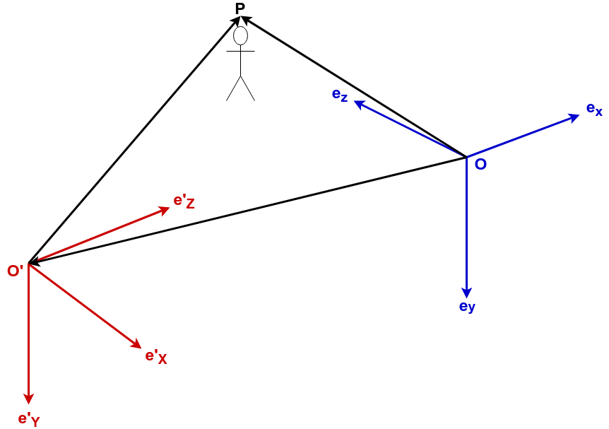

==================================
カメラ座標系とワールド座標系の変換
==================================

`OpenCVのDocumentation <https://docs.opencv.org/2.4/modules/calib3d/doc/camera_calibration_and_3d_reconstruction.html>`__\ にある，ワールド座標系とカメラ座標系の間の変換

.. math::
   \begin{bmatrix}
       x \\ y \\ z
   \end{bmatrix} =
   R
   \begin{bmatrix}
       X \\ Y \\ Z
   \end{bmatrix}
   +
   \mathbf{t}
   :label: coordinate-system-conversion

はぱっと見ただけではわかりづらいので，ワールド座標系とカメラ座標系をしっかりと定め，その間の変換(式 :eq:`coordinate-system-conversion` )を導出します．

.. math::
   \newcommand{\E}{\mathbf{e}}

ここでは原点 :math:`O` ，基底 :math:`\E_x`, :math:`\E_y`, :math:`\E_z` から成る直交座標系を :math:`O[\E_x,\E_y,\E_z]` と表記することにします．

また，ワールド座標系とカメラ座標系をそれぞれ次のように設定します．

+----------------------------------------+-------------------------------------+
| 原点を O' としたときのワールド座標系   |  :math:`O'[\E'_X, \E'_Y, \E'_Z]`    |
+----------------------------------------+-------------------------------------+
| 位置 O のカメラの座標系                |  :math:`O[\E_x, \E_y, \E_z]`        |
+----------------------------------------+-------------------------------------+

カメラに映っている物体の座標を P とし，これをそれぞれの座標系で表現すると

.. math::

   \begin{align*}
   \vec{O'P}
   &= X\E'_X + Y\E'_Y + Z\E'_Z \\
   &=
   \begin{bmatrix}
       \E'_X & \E'_Y & \E'_Z
   \end{bmatrix}
   \begin{bmatrix}
       X \\ Y \\ Z
   \end{bmatrix}
   \\
   \vec{OP}
   &= x\E_x + y\E_y + z\E_z \\
   &=
   \begin{bmatrix}
       \E_x & \E_y & \E_z
   \end{bmatrix}
   \begin{bmatrix}
       x \\ y \\ z
   \end{bmatrix}
   \end{align*}

となります．

ベクトル :math:`\vec{OO'}` をカメラ座標系 :math:`O[\E_x, \E_y, \E_z]` で表現すると

.. math::

   \begin{align*}
   \vec{OO'}
   &= t_x \E_x + t_y \E_y + t_z \E_z \\
   &=
   \begin{bmatrix}
       \E_x & \E_y & \E_z
   \end{bmatrix}
   \begin{bmatrix}
       t_x \\ t_y \\ t_z
   \end{bmatrix}
   \end{align*}

また， :math:`\vec{OP} = \vec{OO'} + \vec{O'P}` より，

.. math::
   \begin{bmatrix}
       \E_x & \E_y & \E_z
   \end{bmatrix}
   \begin{bmatrix}
       x \\ y \\ z
   \end{bmatrix} =
   \begin{bmatrix}
       \E'_X & \E'_Y & \E'_Z
   \end{bmatrix}
   \begin{bmatrix}
       X \\ Y \\ Z
   \end{bmatrix}
   +
   \begin{bmatrix}
       \E_x & \E_y & \E_z
   \end{bmatrix}
   \begin{bmatrix}
       t_x \\ t_y \\ t_z
   \end{bmatrix}
   :label: OP

と書けます．

ワールド座標系 :math:`O'[\E'_X, \E'_Y,\E'_Z]` とカメラ座標系 :math:`O[\E_x,\E_y,\E_z]` はそれぞれ別々の座標系ではあるものの，どちらも同じ3次元空間に共存しており，かつ直交座標系であるため，片方の基底を用いてもう片方の基底を表現することができます．

この変換を回転行列 :math:`R \in \mathbb{R}^{3 \times 3}` を用いて

.. math::

   \begin{bmatrix}
       \E'_X & \E'_Y & \E'_Z
   \end{bmatrix} =
   \begin{bmatrix}
       \E_x & \E_y & \E_z
   \end{bmatrix} R

と表記すると，式 :eq:`OP` は

.. math::

   \begin{bmatrix}
       \E_x & \E_y & \E_z
   \end{bmatrix}
   \begin{bmatrix}
       x \\ y \\ z
   \end{bmatrix} =
   \begin{bmatrix}
       \E_x & \E_y & \E_z
   \end{bmatrix} R
   \begin{bmatrix}
       X \\ Y \\ Z
   \end{bmatrix}
   +
   \begin{bmatrix}
       \E_x & \E_y & \E_z
   \end{bmatrix}
   \begin{bmatrix}
       t_x \\ t_y \\ t_z
   \end{bmatrix}

| と書き換えることができます．
| 両辺から基底部分を取り除くと

.. math::

   \begin{bmatrix}
       x \\ y \\ z
   \end{bmatrix} =
   R
   \begin{bmatrix}
       X \\ Y \\ Z
   \end{bmatrix}
   +
   \begin{bmatrix}
       t_x \\ t_y \\ t_z
   \end{bmatrix}

 .

さらに

.. math::

   \mathbf{t} =
   \begin{bmatrix}
       t_x \\ t_y \\ t_z
   \end{bmatrix}

とおけば，

.. math::

   \begin{bmatrix}
       x \\ y \\ z
   \end{bmatrix} =
   R
   \begin{bmatrix}
       X \\ Y \\ Z
   \end{bmatrix}
   +
   \mathbf{t}

というふうに座標変換を記述することができます．
