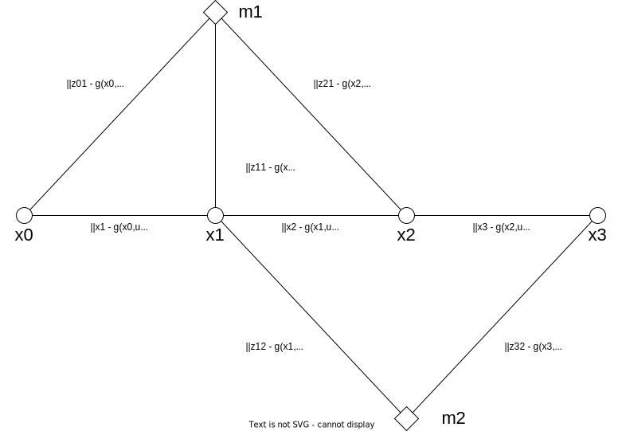

Graph SLAM
==========

Graph SLAMとは
--------------

Graph SLAMとは、SLAMの最適化問題をグラフ構造で表現する手法である。
カメラ姿勢をノードで表現すると、異なる2時刻の姿勢関係をそれらのノードをつなぐエッジで表現することができる。
ランドマークもノードで表現することができる。これにより、ランドマークとカメラ姿勢の関係をこれらをつなぐエッジで表現することができる。

注釈
~~~~

今回は Visual Inertial SLAM を例として確率モデルを記述するが、IMU観測値をたとえば車両への制御入力などに置き換えれば、他のセンサー入力を対象としたSLAMにも応用できる。

運動モデル
~~~~~~~~~~

観測モデル
~~~~~~~~~~

Graph SLAMによる姿勢推定および地図作成
~~~~~~~~~~~~~~~~~~~~~~~~~~~~~~~~~~~~~~

| Graph SLAM ではグラフの各エッジに誤差関数を対応させ、すべてのエッジの誤差関数の総和を最小化することで最適な姿勢とランドマーク座標を求める。
| たとえば時刻 :math:`i` の姿勢を :math:`\mathbf{x}_{i} \in \mathbb{R}^{6}` とし、 :math:`i` から  :math:`i+1` までのIMU観測値 :math:`\mathbf{u}_{i+1} \in \mathbb{R}^{9}` および運動モデル :math:`\mathbf{g}(\mathbf{x}_{i}, \mathbf{u}_{i+1})` を用いて運動モデルに関する誤差

.. math::
    [\mathbf{x}_{i+1} - \mathbf{g}(\mathbf{x}_{i}, \mathbf{u}_{i+1})]^{\top}Q_{k}^{-1}[\mathbf{x}_{i+1} - \mathbf{g}(\mathbf{x}_{i}, \mathbf{u}_{i+1})]

を構成することができる。ここで :math:`Q_{k}` は誤差の共分散を表す行列である。この誤差 :math:`\mathbf{x}_{i}` と  :math:`\mathbf{x}_{i+1}` の間のエッジに対応させる。

また、 :math:`j` 番目のランドマークを :math:`\mathbf{m}_{j}` 、 :math:`i` 番目の姿勢における :math:`j` 番目のランドマークの観測値を :math:`\mathbf{z}_{ij}` とし、観測モデルを :math:`\mathbf{h}(\mathbf{x}_{i}, \mathbf{m}_{j})` とする。
具体的には、たとえばランドマーク :math:`\mathbf{m}_{j}` は物体の3次元座標、ランドマークの観測値 :math:`\mathbf{z}_{ij}` は画像特徴点、観測モデル :math:`\mathbf{h}(\mathbf{x}_{i}, \mathbf{m}_{j})` は透視投影モデルに置き換えることができる。

これらを用いて再投影誤差

.. math::
    || \mathbf{z}_{ij} - \mathbf{h}(\mathbf{x}_{i}, \mathbf{m}_{j}) ||^2

を計算することができる。これを :math:`\mathbf{x}_{i}` と  :math:`\mathbf{m}_{j}` の間のエッジに対応させる。

これら誤差関数の総和を最小化するエッジの値 :math:`\left\{\mathbf{x}^{*}_{0}, \mathbf{x}^{*}_{1}, \mathbf{x}^{*}_{2}, \mathbf{x}^{*}_{3}, \mathbf{x}^{*}_{4}, \mathbf{m}^{*}_{1}, \mathbf{m}^{*}_{2}\right\}` を求める。これが Graph SLAM による姿勢推定および地図作成の問題である。

確率モデルによる表現
~~~~~~~~~~~~~~~~~~~~

| 確率モデルで表現してみよう。
| 初期時刻 :math:`0` から時刻 :math:`T` までの姿勢を :math:`\mathbf{x}_{0:T} = \{\mathbf{x}_{1},...,\mathbf{x}_{T}\}` 、 :math:`\mathbf{x}_{0:T}` から観測されたランドマークの集合を :math:`\mathbf{m}_{1:N} = \{\mathbf{m}_{1},...,\mathbf{m}_{N}\}` とする。
| また、この間に得られたIMU観測値の集合を :math:`\mathbf{u}_{1:T} = \{\mathbf{u}_{1},...,\mathbf{u}_{T}\}` 、ランドマーク観測値の集合を :math:`Z_{0:T} = \{\mathbf{z}_{ij} \;|\; (i, j) \in S_{0:T}\}` とする。ここで :math:`S_{0:T}` は時刻 :math:`0` から時刻 :math:`T` までの観測可能な姿勢とランドマークの組み合わせを表している。
| 我々の目的は、次の分布を明らかにすることである。

.. math::
    p(\mathbf{x}_{0:T}, \mathbf{m}_{1:N}\;|\;\mathbf{u}_{1:T}, Z_{0:T})
    :label: fullslamposterior

| すなわち、IMUやカメラから得られた観測情報を用いて、時刻 :math:`0` から :math:`T` までの姿勢およびその間に観測されたランドマークの分布を求めるという問題である。

状態分布の再帰的推定法の導出
~~~~~~~~~~~~~~~~~~~~~~~~~~~~

| すべての観測値から姿勢およびランドマークの分布 :eq:`fullslamposterior` を高精度に求める手法 [#sfm]_ は存在するものの、計算コストが高い。一般的にSLAMは高速に動作することを求められるため、ある事前情報をたよりにして、特定時刻の状態を求めることが一般的である。
| ここでは時刻 :math:`T-1` の状態をたよりにして時刻 :math:`T` の状態を求める確率モデルを導出する。

| まずはベイズの定理に従って :eq:`fullslamposterior` を分解する。

.. math::
   &p(\mathbf{x}_{0:T}, \mathbf{m}_{1:N}\;|\;\mathbf{u}_{1:T}, Z_{0:T}) \\
   &= \eta_{T} \; p(Z_{T}\;|\;\mathbf{x}_{0:T},\mathbf{m}_{1:N},\mathbf{u}_{1:N},Z_{0:T-1})\;p(\mathbf{x}_{0:T},\mathbf{m}_{1:N}\;|\;\mathbf{u}_{1:T},Z_{0:T-1}) \\
   :label: factored-posterior

ここで :math:`\eta_{T}` は次で計算される定数である。 :math:`\eta_{T}` は観測値 :math:`\mathbf{u}_{1:T},Z_{0:T}` の確率分布のみで構成されているため、一度これらが観測されてしまえば :math:`\eta_{T}` は変化しない。したがって姿勢推定の問題では :math:`\eta_{T}` は定数として扱うことができる。

.. math::
    \eta_{T} = \frac{p(\mathbf{u}_{1:T},Z_{0:T-1})}{p(\mathbf{u}_{1:T},Z_{0:T})}

| さて、 :math:`Z_{T}` は時刻 :math:`T` に得られたランドマークの観測値だが、 :math:`Z_{T}` の分布は同時刻の姿勢 :math:`\mathbf{x}_{T}` およびそこで観測できるランドマークの座標 :math:`\mathbf{m}_{1:N}` にしか依存しない。これは時刻 :math:`i` から観測された :math:`j` 番目のランドマーク :math:`\mathbf{z}_{ij}` を :math:`\mathbf{h}(\mathbf{x}_{i},\mathbf{m}_{j})` でモデル化するためである。したがって、 :math:`Z_{T}` の確率分布を次のように単純化できる [#simplify_z_distribution]_ 。

.. math::
    p(Z_{T}\;|\;\mathbf{x}_{0:T},\mathbf{m}_{1:N},\mathbf{u}_{1:N},Z_{0:T-1}) = p(Z_{T}\;|\;\mathbf{x}_{T},\mathbf{m}_{1:N})

:eq:`factored-posterior` のもうひとつの確率についてもベイズ則を適用する。

.. math::
    &p(\mathbf{x}_{0:T},\mathbf{m}_{1:N}\;|\;\mathbf{u}_{1:T},Z_{0:T-1}) \\
    &= p(\mathbf{x}_{T}\;|\;\mathbf{x}_{0:T-1},\mathbf{m}_{1:N},\mathbf{u}_{1:T},Z_{0:T-1})\;
      p(\mathbf{x}_{0:T-1},\mathbf{m}_{1:N}\;|\;\mathbf{u}_{1:T},Z_{0:T-1})

我々は時刻 :math:`T` の姿勢 :math:`\mathbf{x}_{T}` をオドメトリ推定モデル :math:`\mathbf{g}(\mathbf{x}_{T-1}, \mathbf{u}_{T})` で予測する。したがって先ほどと同様の議論により、次のような簡略化を行うことができる。

.. math::
    &p(\mathbf{x}_{0:T},\mathbf{m}_{1:N}\;|\;\mathbf{u}_{1:T},Z_{0:T-1}) \\
    &=
    p(\mathbf{x}_{T}\;|\;\mathbf{x}_{0:T-1},\mathbf{m}_{1:N},\mathbf{u}_{1:T},Z_{0:T-1})\;
    p(\mathbf{x}_{0:T-1},\mathbf{m}_{1:N}\;|\;\mathbf{u}_{1:T},Z_{0:T-1}) \\
    &=
    p(\mathbf{x}_{T}\;|\;\mathbf{x}_{T-1},\mathbf{u}_{T})\;
    p(\mathbf{x}_{0:T-1},\mathbf{m}_{1:N}\;|\;\mathbf{u}_{1:T},Z_{0:T-1}) \\
    &=
    p(\mathbf{x}_{T}\;|\;\mathbf{x}_{T-1},\mathbf{u}_{T})\;
    p(\mathbf{x}_{0:T-1},\mathbf{m}_{1:N}\;|\;\mathbf{u}_{1:T-1},Z_{0:T-1}) \\

最後の変形は、 :math:`\mathbf{x}_{T-1}` までの姿勢を予測するためには時刻 :math:`T-1` までのIMU観測値があれば十分であることを表している。

これらを総合して式 :eq:`factored-posterior` を再構成すると、時刻 :math:`T-1` における状態分布から時刻 :math:`T` の状態分布を得る式を導くことができる。

.. math::
   &p(\mathbf{x}_{0:T}, \mathbf{m}_{1:N}\;|\;\mathbf{u}_{1:T}, Z_{0:T}) \\
   &= \eta_{T} \; p(Z_{T}\;|\;\mathbf{x}_{0:T},\mathbf{m}_{1:N},\mathbf{u}_{1:N},Z_{0:T-1})\;p(\mathbf{x}_{0:T},\mathbf{m}_{1:N}\;|\;\mathbf{u}_{1:T},Z_{0:T-1}) \\
   &= \eta_{T} \;
    p(Z_{T}\;|\;\mathbf{x}_{T},\mathbf{m}_{1:N}) \;
    p(\mathbf{x}_{T}\;|\;\mathbf{x}_{T-1},\mathbf{u}_{T})\;
    p(\mathbf{x}_{0:T-1},\mathbf{m}_{1:N}\;|\;\mathbf{u}_{1:T-1},Z_{0:T-1}) \\

ある時刻の分布はその前の時刻の分布がわかれば導くことができる。これを繰り返していくと次のようになる。

.. math::
   \begin{align}
   p(\mathbf{x}_{0:T}, \mathbf{m}_{1:N}\;|\;\mathbf{u}_{1:T}, Z_{0:T})
   = \;
    & \eta_{T} \; p(Z_{T}\;|\;\mathbf{x}_{T},\mathbf{m}_{1:N}) \; p(\mathbf{x}_{T}\;|\;\mathbf{x}_{T-1},\mathbf{u}_{T}) \; \\
    & ... \\
    & \eta_{2} \; p(Z_{2}\;|\;\mathbf{x}_{2},\mathbf{m}_{1:N}) \; p(\mathbf{x}_{2}\;|\;\mathbf{x}_{1},\mathbf{u}_{2}) \; \\
    & \eta_{1} \; p(Z_{1}\;|\;\mathbf{x}_{1},\mathbf{m}_{1:N}) \; p(\mathbf{x}_{1}\;|\;\mathbf{x}_{0},\mathbf{u}_{1}) \; p(\mathbf{x}_{0}) \\
   =\;
    &\eta_{1:T} \; p(\mathbf{x}_{0})\; \prod_{i=1}^{T} \left[p(Z_{i}\;|\;\mathbf{x}_{i},\mathbf{m}_{1:N}) \; p(\mathbf{x}_{i}\;|\;\mathbf{x}_{i-1},\mathbf{u}_{i})\right] \\
    &\text{where}\quad \eta_{1:T} = \prod_{i=1}^{T} \eta_{i}
   \end{align}

この式では時刻 :math:`0` における姿勢の分布を :math:`p(\mathbf{x}_{0})` と置いている。一般的に :math:`\mathbf{x}_{0}` は推定するものではなく基準座標として任意に定めるものであるため、このように置くことができる。ここでは時刻 :math:`0` においてランドマークの座標は全く不明であると仮定しているが、もし何らかの方法でランドマーク座標の分布を事前に得られるのであれば、時刻 :math:`0` の状態分布は :math:`p(\mathbf{x}_{0}, \mathbf{m}_{1:N})` のようになるであろう。

一般的なSLAMの問題ではすべてのランドマークをすべての姿勢から観測できるわけではないため、この仮定を踏まえて上記の式をさらに具体的に次のように書くことができる。

.. math::
   &p(\mathbf{x}_{0:T}, \mathbf{m}_{1:N}\;|\;\mathbf{u}_{1:T}, Z_{0:T}) \\
   &=
    \eta_{1:T} \; p(\mathbf{x}_{0})\; \prod_{i=1}^{T} \left[p(Z_{i}\;|\;\mathbf{x}_{i},\mathbf{m}_{1:N}) \; p(\mathbf{x}_{i}\;|\;\mathbf{x}_{i-1},\mathbf{u}_{i})\right] \\
   &=
    \eta_{1:T} \; p(\mathbf{x}_{0})\; \prod_{k=1}^{T} p(\mathbf{x}_{k}\;|\;\mathbf{x}_{k-1},\mathbf{u}_{k}) \prod_{(i,j)\in S_{0:T}} p(\mathbf{z}_{ij}\;|\;\mathbf{x}_{i},\mathbf{m}_{j})
   :label: posterior-decomposition

このようにして、 状態分布を推定する問題を、

1. 各時刻におけるオドメトリ :math:`p(\mathbf{x}_{k}\;|\;\mathbf{x}_{k-1},\mathbf{u}_{k}), k = 1,...,T` を推定する問題
2. 各ランドマークの観測値の分布 :math:`p(\mathbf{z}_{ij}\;|\;\mathbf{x}_{i},\mathbf{m}_{j}),\;(i, j) \in S_{0:T}` を求める問題

に変換することができた。

初期状態分布の記述
~~~~~~~~~~~~~~~~~~

初期姿勢 :math:`\mathbf{x}_{0}` はプログラム上で固定値にすればよいため分布を仮定する必要はないのだが、便宜的に次のように設定しておく。

.. math::
    p(\mathbf{x}_{0}) \propto \exp\{-\frac{1}{2}\left[\mathbf{x}_{0} - \mathbf{0}\right]^{\top} Q_{0}^{-1} \left[\mathbf{x}_{0} - \mathbf{0}\right]\} = \mathbf{x}_{0}^{\top} Q_{0}^{-1} \mathbf{x}_{0},\\
   \text{where}\quad Q_{0}^{-1} = \operatorname{diag}(\infty,...,\infty)

これによって初期姿勢が :math:`\mathbf{0}` に拘束される。

運動モデルによる予測
~~~~~~~~~~~~~~~~~~~~

式 :eq:`posterior-decomposition` において、 :math:`p(\mathbf{x}_{k}\;|\;\mathbf{x}_{k-1},\mathbf{u}_{k})` は、前の時刻の姿勢 :math:`\mathbf{x}_{k-1}` および前の時刻から現在時刻までのIMU観測値 :math:`\mathbf{u}_{k}` に基づいた現在の姿勢の予測を表現している。なお、センサ構成によっては :math:`\mathbf{u}_{k}` をアクセルへの入力値や車輪の回転数などとすることもある。

時刻 :math:`k` の姿勢 :math:`\mathbf{x}_{k}` に対して運動モデルの予測 :math:`\mathbf{g}(\mathbf{x}_{k-1}, \mathbf{u}_{k})` の誤差が分散 :math:`Q_{k} \in \mathbb{R}^{6 \times 6}` の正規分布に従うとすると、この分布は

.. math::
    p(\mathbf{x}_{k}\;|\;\mathbf{x}_{k-1},\mathbf{u}_{k}) =
    \frac{1}{\sqrt{(2\pi)^{6} \det(Q_{k})}}
    \exp(-\frac{1}{2}
    \left[\mathbf{x}_{k} - \mathbf{g}(\mathbf{x}_{k-1}, \mathbf{u}_{k})\right]^{\top} Q_{k}^{-1} \left[\mathbf{x}_{k} - \mathbf{g}(\mathbf{x}_{k-1}, \mathbf{u}_{k})\right])

と記述することができる。

観測モデルによる予測
~~~~~~~~~~~~~~~~~~~~

式 :eq:`posterior-decomposition` において、 :math:`p(\mathbf{z}_{ij}\;|\;\mathbf{x}_{i},\mathbf{m}_{j})` は、 :math:`j` 番目のランドマーク :math:`\mathbf{m}_{j}` を時刻 :math:`i` のカメラに投影することで得られる、ランドマーク観測値の予測を表現している。ランドマークの観測値と予測とのずれが分散 :math:`R_{ij} \in \mathbb{R}^{2 \times 2}` の正規分布に従うとすると、このずれの分布は

.. math::
    p(\mathbf{z}_{ij} \;|\; \mathbf{x}_{i}, \mathbf{m}_{j}) = \frac{1}{\sqrt{(2\pi)^{2}\det(R_{ij})}}\exp\{-\frac{1}{2}\left[\mathbf{z}_{ij} - \mathbf{h}(\mathbf{x}_{i},\mathbf{m}_{j})\right]^{\top}R_{ij}^{-1}\left[\mathbf{z}_{ij} - \mathbf{h}(\mathbf{x}_{i},\mathbf{m}_{j})\right]\}

と書くことができる。

なお、共分散 :math:`Q_{k}` および :math:`R_{ij}` はハイパーパラメータとして与えることもできるが、統計的に計算することも可能である。

対数尤度関数
~~~~~~~~~~~~

推定したい状態は確率分布の頂点の値である。

確率分布が最大値をとるということは、そこに真の状態および真のランドマーク位置がある可能性が高いということである。

.. math::
    \underset{\mathbf{x}_{0:T},\,\mathbf{m}_{0:N}}{\arg\max} \; p(\mathbf{x}_{0:T}, \mathbf{m}_{1:N}\;|\;\mathbf{u}_{1:T}, Z_{0:T}) \\

式 :eq:`posterior-decomposition` は正規分布の積で表される。したがってその対数を計算すると指数部分が外れ、最大確率をとる状態を計算しやすくなる。

.. math::
   &\log p(\mathbf{x}_{0:T}, \mathbf{m}_{1:N}\;|\;\mathbf{u}_{1:T}, Z_{0:T}) \\
   =\;
   &\text{constant}
   + \log p(\mathbf{x}_{0})
   + \sum_{k=1}^{T} \log p(\mathbf{x}_{k}\;|\;\mathbf{x}_{k-1},\mathbf{u}_{k})
   + \sum_{(i,j)\in S_{0:T}} \log p(\mathbf{z}_{ij}\;|\;\mathbf{x}_{i},\mathbf{m}_{j}) \\
   =\;
   &\text{constant} \\
   &- \frac{1}{2}\mathbf{x}_{0}^{\top}Q_{0}^{-1}\mathbf{x}_{0} \\
   &- \frac{1}{2} \sum_{k=1}^{T} \left[\mathbf{x}_{k} - \mathbf{g}(\mathbf{x}_{k-1},\mathbf{u}_{k})\right]^{\top} Q_{k}^{-1} \left[\mathbf{x}_{k} - \mathbf{g}(\mathbf{x}_{k-1},\mathbf{u}_{k})\right] \\
   &- \frac{1}{2} \sum_{(i,j)\in S_{0:T}} \left[\mathbf{z}_{ij} - \mathbf{h}(\mathbf{x}_{i},\mathbf{m}_{j})\right]^{\top}R_{ij}^{-1}\left[\mathbf{z}_{ij} - \mathbf{h}(\mathbf{x}_{i},\mathbf{m}_{j})\right]

対数関数は単調増加関数なので、もとの確率分布を最大化する状態と、対数関数を適用したあとの確率分布を最大化する状態は等しい。

.. math::
    \underset{\mathbf{x}_{0:T},\,\mathbf{m}_{0:N}}{\arg\max} \; p(\mathbf{x}_{0:T}, \mathbf{m}_{1:N}\;|\;\mathbf{u}_{1:T}, Z_{0:T})
    &= \underset{\mathbf{x}_{0:T},\,\mathbf{m}_{0:N}}{\arg\max} \; \log p(\mathbf{x}_{0:T}, \mathbf{m}_{1:N}\;|\;\mathbf{u}_{1:T}, Z_{0:T}) \\

結果として、最大確率をとる状態を求める問題はは次の最小化問題に帰結する。

.. math::
    \underset{\mathbf{x}_{0:T},\,\mathbf{m}_{0:N}}{\arg\max} \; p(\mathbf{x}_{0:T}, \mathbf{m}_{1:N}\;|\;\mathbf{u}_{1:T}, Z_{0:T})
    &= \underset{\mathbf{x}_{0:T},\,\mathbf{m}_{0:N}}{\arg\max} \; -E_{T}(\mathbf{x}_{0:T}, \mathbf{m}_{1:N}\;|\;\mathbf{u}_{1:T}, Z_{0:T}) \\
    &= \underset{\mathbf{x}_{0:T},\,\mathbf{m}_{0:N}}{\arg\min}\; E_{T}(\mathbf{x}_{0:T}, \mathbf{m}_{1:N}\;|\;\mathbf{u}_{1:T}, Z_{0:T}), \\
    \\
    E_{T}(\mathbf{x}_{0:T}, \mathbf{m}_{1:N}\;|\;\mathbf{u}_{1:T}, Z_{0:T})
    &= \mathbf{x}_{0}^{\top}Q_{0}^{-1}\mathbf{x}_{0} \\
    &+ \sum_{k=1}^{T} \left[\mathbf{x}_{k} - \mathbf{g}(\mathbf{x}_{k-1},\mathbf{u}_{k})\right]^{\top} Q_{k}^{-1} \left[\mathbf{x}_{k} - \mathbf{g}(\mathbf{x}_{k-1},\mathbf{u}_{k})\right] \\
    &+ \sum_{(i,j)\in S_{0:T}} \left[\mathbf{z}_{ij} - \mathbf{h}(\mathbf{x}_{i},\mathbf{m}_{j})\right]^{\top}R_{ij}^{-1}\left[\mathbf{z}_{ij} - \mathbf{h}(\mathbf{x}_{i},\mathbf{m}_{j})\right] \\
   :label: error-function

誤差関数の最小化
----------------

さて、式 :eq:`error-function` に示す誤差関数は残差 :math:`\mathbf{r}_{T}(\mathbf{x}_{0:T}, \mathbf{m}_{1:N}\;|\;\mathbf{u}_{1:T}, Z_{0:T})` および共分散行列 :math:`\Sigma_{T}` を用いて次のように表現することができる。

.. math::
   \mathbf{r}_{T}(\mathbf{x}_{0:T}, \mathbf{m}_{1:N}\;|\;\mathbf{u}_{1:T}, Z_{0:T}) =
   \begin{bmatrix}
   \mathbf{x}_{0} \\
   \mathbf{x}_{1} - \mathbf{g}(\mathbf{x}_{0}, \mathbf{u}_{1}) \\
   \vdots \\
   \mathbf{x}_{T} - \mathbf{g}(\mathbf{x}_{T-1}, \mathbf{u}_{T}) \\
   \mathbf{z}_{01} - \mathbf{h}(\mathbf{x}_{0},\mathbf{m}_{1}) \\
   \vdots \\
   \mathbf{z}_{TN} - \mathbf{h}(\mathbf{x}_{T},\mathbf{m}_{N})
   \end{bmatrix}

.. math::
   \Sigma_{T} =
   \begin{bmatrix}
   Q_{0} \\
   & Q_{1} \\
   & & \ddots \\
   & & & Q_{T} \\
   & & & & R_{00} \\
   & & & & & \ddots \\
   & & & & & & R_{TN}
   \end{bmatrix}

.. math::
   E_{T}(\mathbf{x}_{0:T}, \mathbf{m}_{1:N}\;|\;\mathbf{u}_{1:T}, Z_{0:T})
   = \mathbf{r}_{T}(\mathbf{x}_{0:T}, \mathbf{m}_{1:N}\;|\;\mathbf{u}_{1:T}, Z_{0:T})^{\top} \Sigma_{T}^{-1} \mathbf{r}_{T}(\mathbf{x}_{0:T}, \mathbf{m}_{1:N}\;|\;\mathbf{u}_{1:T}, Z_{0:T})

このままでは表記が煩雑なので状態を :math:`\mathbf{y}_{T} = \left[\mathbf{x}_{0:T}^{\top},\; \mathbf{m}_{1:N}^{\top}\right]^{\top}` とおいて次のように書くことにしよう。

.. math::
   E_{T}(\mathbf{y}_{T}) = \mathbf{r}_{T}(\mathbf{y}_{T})^{\top} \Sigma_{T}^{-1} \mathbf{r}_{T}(\mathbf{y}_{T})

この誤差関数はGauss-Newton法によって最小化できる。

誤差関数の微分
~~~~~~~~~~~~~~

誤差関数 :math:`E_{T}` を状態 :math:`\mathbf{y}_{T}` で微分すると次のようになる。

.. math::
    J = \frac{\partial E_{T}}{\partial \mathbf{y}_{T}} =
    \begin{bmatrix}
     I          &          &             &             &             &             &             \\
    -G_{0}      & \ddots   &             &             &             &             &             \\
                & \ddots   & I           &             &             &             &             \\
                &          & -G_{T-1}    & I           &             &             &             \\
    -H^{x}_{01} &          &             &             & -H^{m}_{01} &             &             \\
                & \ddots   &             &             &             & \ddots      &             \\
                &          & \ddots      &             &             & \ddots      &             \\
                &          &             & -H^{x}_{TN} &             &             & -H^{m}_{TN} \\
    \end{bmatrix}

ここで :math:`G_{i},\; H^{x}_{ij},\; H^{m}_{ij}` は運動モデルおよび観測モデルのJacobianを表している。

.. math::
    G_{i} = \frac{\partial \mathbf{g}(\mathbf{x}_{i}, \mathbf{u}_{i+1})}{\partial \mathbf{x}_{i}},\;
    H^{x}_{ij} = \frac{\partial \mathbf{h}(\mathbf{x}_{i},\mathbf{m}_{j})}{\partial \mathbf{x}_{i}},\;
    H^{m}_{ij} = \frac{\partial \mathbf{h}(\mathbf{x}_{i},\mathbf{m}_{j})}{\partial \mathbf{m}_{j}}

運動モデルを異なる時刻の姿勢で微分すると :math:`0` になる。

.. math::
    \frac{\partial \mathbf{g}(\mathbf{x}_{i}, \mathbf{u}_{i+1})}{\partial \mathbf{x}_{k}} &= 0 \quad \text{if} \; i \neq k  \\

観測モデルも異なる時刻の姿勢もしくは異なるランドマークで微分すると :math:`0` になる。

.. math::
    \frac{\partial \mathbf{h}(\mathbf{x}_{i},\mathbf{m}_{j})}{\partial \mathbf{x}_{k}} &= 0    \quad \text{if} \; i \neq k  \\
    \frac{\partial \mathbf{h}(\mathbf{x}_{i},\mathbf{m}_{j})}{\partial \mathbf{m}_{j}} &= 0    \quad \text{if} \; j \neq k  \\

したがって行列 :math:`J` は非常にスパースになる。

具体例
~~~~~~

次の例を用いてJacobianの形をより具体的に見てみよう。

| 姿勢を :math:`\mathbf{x}_{0:4} = \{\mathbf{x}_{0},\mathbf{x}_{1},\mathbf{x}_{2},\mathbf{x}_{3}\}` 、 ランドマークを :math:`\mathbf{m}_{1:2} = \{\mathbf{m}_{1},\mathbf{m}_{2}\}` とする。
| また、姿勢 :math:`\{\mathbf{x}_{0},\mathbf{x}_{1},\mathbf{x}_{2}\}` からランドマーク :math:`\mathbf{m}_{0}` を、姿勢 :math:`\{\mathbf{x}_{1},\mathbf{x}_{3}\}` からランドマーク :math:`\mathbf{m}_{1}` を観測できるものとする。

姿勢とランドマークの関係を図で表すとこのようになる。

|

IMU観測値 :math:`\mathbf{u}_{1:4}` およびランドマークの観測値 :math:`Z_{1:4}` はそれぞれ次のようになる。

.. math::
    \mathbf{u}_{1:4} &= \{\mathbf{u}_{1},\mathbf{u}_{2},\mathbf{u}_{3}\}  \\
    Z_{1:4} &= \{\mathbf{z}_{11},\mathbf{z}_{21},\mathbf{z}_{22},\mathbf{z}_{32},\mathbf{z}_{42}\}

これらをもとに誤差関数を構成しよう。

.. math::
   \mathbf{r}_{4}(\mathbf{y}_{4}) =
   \begin{bmatrix}
        \mathbf{x}_{0} - \mathbf{0} \\
        \mathbf{x}_{1} - \mathbf{g}(\mathbf{x}_{0}, \mathbf{u}_{1}) \\
        \mathbf{x}_{2} - \mathbf{g}(\mathbf{x}_{1}, \mathbf{u}_{2}) \\
        \mathbf{x}_{3} - \mathbf{g}(\mathbf{x}_{2}, \mathbf{u}_{3}) \\
        \mathbf{z}_{01} - \mathbf{h}(\mathbf{x}_{0}, \mathbf{m}_{1}) \\
        \mathbf{z}_{11} - \mathbf{h}(\mathbf{x}_{1}, \mathbf{m}_{1}) \\
        \mathbf{z}_{21} - \mathbf{h}(\mathbf{x}_{2}, \mathbf{m}_{1}) \\
        \mathbf{z}_{12} - \mathbf{h}(\mathbf{x}_{1}, \mathbf{m}_{2}) \\
        \mathbf{z}_{32} - \mathbf{h}(\mathbf{x}_{3}, \mathbf{m}_{2}) \\
    \end{bmatrix} \\

.. math::
   E_{4}(\mathbf{x}_{0:3}, \mathbf{m}_{1:2} \;|\; \mathbf{u}_{1:4}, Z_{1:4})
   = \mathbf{r}_{4}(\mathbf{x}_{0:3}, \mathbf{m}_{1:2})^{\top} \Sigma_{4}^{-1} \mathbf{r}_{4}(\mathbf{x}_{0:3}, \mathbf{m}_{1:2})

状態を :math:`\mathbf{y}_{4} = \left[\mathbf{x}_{0},\mathbf{x}_{1},\mathbf{x}_{2},\mathbf{x}_{3},\mathbf{m}_{1},\mathbf{m}_{2}\right]` とすると誤差関数の微分は次のようになる。

.. math::
   J_{4} = \frac{\partial \mathbf{r}_{4}}{\partial \mathbf{y}_{4}} =
   \begin{bmatrix}
      I         &             &             &             &             &             \\
     -G_{0}     & I           &             &             &             &             \\
                & -G_{1}      & I           &             &             &             \\
                &             & -G_{2}      & I           &             &             \\
    -H^{x}_{01} &             &             &             & -H^{m}_{01} &             \\
                & -H^{x}_{11} &             &             & -H^{m}_{11} &             \\
                &             & -H^{x}_{21} &             & -H^{m}_{21} &             \\
                & -H^{x}_{12} &             &             &             & -H^{m}_{12} \\
                &             &             & -H^{x}_{32} &             & -H^{m}_{32} \\
   \end{bmatrix}
   :label: jacobian-j4

Gauss-Newton法による誤差最小化
~~~~~~~~~~~~~~~~~~~~~~~~~~~~~~

| 具体的な最小化の式を見る前に、Gauss-Newton法について解説しよう。Gauss-Newton法は最小化問題の近似式を繰り返し最小化することで解を得る手法である。
| ある値で誤差関数を二次近似し、その最小値を求める。今度はその最小値を用いて誤差関数を二次近似し、得られた近似式の最小値を求める。これを繰り返すことで誤差関数を最小化する状態を求める。

誤差関数 :math:`E_{T}(\mathbf{y}_{T}) = \mathbf{r}_{T}(\mathbf{y}_{T})^{\top} \Sigma_{T}^{-1} \mathbf{r}_{T}(\mathbf{y}_{T})` を最小化する問題を考えよう。

Gauss-Newton法ではまず初期値 :math:`\mathbf{y}_{T}^{(0)}` を定め、そのまわりで誤差関数 :math:`E_{T}` を最小化する状態 :math:`\Delta \mathbf{y}_{T}^{(0)}` を求める。

.. math::
   E_{T}(\mathbf{y}_{T}^{(0)} + \Delta \mathbf{y}_{T}^{(0)}) =
   \mathbf{r}_{T}(\mathbf{y}_{T}^{(0)} + \Delta \mathbf{y}_{T}^{(0)})^{\top} \Sigma_{T}^{-1} \mathbf{r}_{T}(\mathbf{y}_{T}^{(0)} + \Delta \mathbf{y}_{T}^{(0)})

| この問題は解析的に解けないため、誤差関数を近似し、それを最小化する状態 :math:`\mathbf{y}_{T}^{(0)} + \Delta \mathbf{y}_{T}^{(0)}` を求める。
| まずは残差 :math:`\mathbf{r}_{T}` を近似する。

.. math::
   \mathbf{r}_{T}(\mathbf{y}_{T}^{(0)} + \Delta \mathbf{y}_{T}^{(0)})
   &\approx \mathbf{r}_{T}(\mathbf{y}_{T}^{(0)}) + \left. \frac{\partial \mathbf{r}_{T}}{\partial \mathbf{y}_{T}}\right|_{\mathbf{y}_{T}^{(0)}} \Delta \mathbf{y}_{T}^{(0)}\\
   &= \mathbf{r}_{T}(\mathbf{y}_{T}^{(0)}) + J_{T}^{(0)} \Delta \mathbf{y}_{T}^{(0)},
   \quad J_{T}^{(0)} = \left. \frac{\partial \mathbf{r}_{T}}{\partial \mathbf{y}_{T}}\right|_{\mathbf{y}_{T}^{(0)}}

これを用いて誤差関数 :math:`E_{T}` を近似し、 :math:`\tilde{E}_{T}^{(0)}` とおく。

.. math::
   &\tilde{E}_{T}^{(0)}(\Delta \mathbf{y}_{T}^{(0)}) \\
   &:= \left[ \mathbf{r}_{T}(\mathbf{y}_{T}^{(0)}) + J_{T}^{(0)} \Delta \mathbf{y}_{T}^{(0)} \right]^{\top}
   \Sigma_{T}^{-1}
   \left[ \mathbf{r}_{T}(\mathbf{y}_{T}^{(0)}) + J_{T}^{(0)} \Delta \mathbf{y}_{T}^{(0)} \right] \\
   &= \mathbf{r}_{T}(\mathbf{y}_{T}^{(0)})^{\top} \Sigma_{T}^{-1} \mathbf{r}_{T}(\mathbf{y}_{T}^{(0)})
   + 2 \Delta {\mathbf{y}_{T}^{(0)}}^{\top} {J_{T}^{(0)}}^{\top} \Sigma_{T}^{-1} \mathbf{r}_{T}(\mathbf{y}_{T}^{(0)})
   + \Delta {\mathbf{y}_{T}^{(0)}}^{\top} {J_{T}^{(0)}}^{\top} \Sigma_{T}^{-1} J_{T}^{(0)} \Delta \mathbf{y}_{T}^{(0)}

誤差関数の近似結果 :math:`\tilde{E}_{T}^{(0)}` を最小化する状態ステップ幅 :math:`\mathbf{y}_{T}^{(0)}` を求めるには、 :math:`\tilde{E}_{T}^{(0)}` を微分し、それを :math:`\mathbf{0}` とおけばよい。

.. math::
   \frac{\partial \tilde{E}_{T}^{(0)}}{\partial \Delta \mathbf{y}_{T}^{(0)}}
   = 2 {J_{T}^{(0)}}^{\top} \Sigma_{T}^{-1} \mathbf{r}_{T}(\mathbf{y}_{T}^{(0)}) + 2 {J_{T}^{(0)}}^{\top} \Sigma_{T}^{-1} J_{T}^{(0)} \Delta \mathbf{y}_{T}^{(0)}
   = \mathbf{0}

したがって、近似結果 :math:`\tilde{E}_{T}^{(0)}` を最小化するステップ幅 :math:`\Delta \mathbf{y}_{T}^{(0)}` は次の式で得られる。

.. math::
   \Delta \mathbf{y}_{T}^{(0)} = - \left({J_{T}^{(0)}}^{\top} \Sigma_{T}^{-1} J_{T}^{(0)}\right)^{-1} {J_{T}^{(0)}}^{\top} \Sigma_{T}^{-1} \mathbf{r}_{T}(\mathbf{y}_{T}^{(0)})
   :label: gauss-newton-update

さて、 :math:`\tilde{E}_{T}^{(0)}` はあくまでもとの誤差関数 :math:`E_{T}` の近似式なので :math:`\mathbf{y}_{T}^{(0)} + \Delta \mathbf{y}_{T}^{(0)}` はもとの誤差関数 :math:`E_{T}` を最小化する値ではない。しかし近似が十分に優れているならば、 :math:`E_{T}(\mathbf{y}_{T}^{(0)} + \Delta \mathbf{y}_{T}^{(0)}) < E_{T}(\mathbf{y}_{T}^{(0)})` となっているはずである。したがって、次は :math:`\mathbf{y}_{T}^{(1)} = \mathbf{y}_{T}^{(0)} + \Delta \mathbf{y}_{T}^{(0)}` とし、 :math:`\mathbf{y}_{T}^{(1)}` のまわりで誤差関数 :math:`E_{T}` を近似し、それを最小化するステップ幅 :math:`\Delta \mathbf{y}_{T}^{(1)}` を求める。Gauss-Newton法は誤差関数の変化が収束するまでこの操作を繰り返し、誤差関数 :math:`E_{T}` を最小化する状態の値を求める。

1. 初期値 :math:`\mathbf{y}_{T}^{(0)}` を定める
2. :math:`\mathbf{y}_{T}^{(0)}` のまわりで残差 :math:`\mathbf{r}_{T}` を近似し、 :math:`J_{T}^{(0)}` を求める
3. ステップ幅 :math:`\Delta \mathbf{y}_{T}^{(0)} = - ({J_{T}^{(0)}}^{\top} \Sigma_{T}^{-1} J_{T}^{(0)})^{-1} {J_{T}^{(0)}}^{\top} \Sigma_{T}^{-1} \mathbf{r}_{T}(\mathbf{y}_{T}^{(0)})` を求める
4. ステップ幅を用いて状態を更新する :math:`\mathbf{y}_{T}^{(1)} = \mathbf{y}_{T}^{(0)} + \Delta \mathbf{y}_{T}^{(0)}`
5. 更新された状態を用いてステップ2以降を繰り返す

計算量の低減
~~~~~~~~~~~~

SLAMは一般的に低消費電力あるいは計算量が限られたデバイスで動作することが求められるため、高速な状態推定が必要とされる。ではGauss-Newton法において計算量のボトルネックとなるのはどの部分だろうか。それは式 :eq:`gauss-newton-update` のステップ幅更新におけるヘッシアンの逆行列 :math:`(J_{T}^{\top} \Sigma_{T}^{-1} J_{T})^{-1}` の計算である [#simplify_step_times]_ 。

式 :eq:`jacobian-j4` を例としてヘッシアンを計算してみよう。

..
   &=
   \begin{bmatrix}
      I         & -G_{0}^{\top} &               &               & -{H^{x}_{01}}^{\top} &                      &                      &                      &                      \\
                & I             & -G_{1}^{\top} &               &                      & -{H^{x}_{11}}^{\top} &                      & -{H^{x}_{12}}^{\top} &                      \\
                &               & I             & -G_{2}^{\top} &                      &                      & -{H^{x}_{21}}^{\top} &                      &                      \\
                &               &               & I             &                      &                      &                      &                      & -{H^{x}_{32}}^{\top} \\
                &               &               &               & -{H^{m}_{01}}^{\top} & -{H^{m}_{11}}^{\top} & -{H^{m}_{21}}^{\top} &                      &                      \\
                &               &               &               &                      &                      &                      & -{H^{m}_{12}}^{\top} & -{H^{m}_{32}}^{\top} \\
   \end{bmatrix}
   \begin{bmatrix}
     Q_{0}^{-1}            &                        &                        &                        &                        &             \\
     -Q_{1}^{-1}G_{0}      & Q_{1}^{-1}             &                        &                        &                        &             \\
                           & -Q_{2}^{-1}G_{1}       & Q_{2}^{-1}             &                        &                        &             \\
                           &                        & -Q_{3}^{-1}G_{2}       & Q_{3}^{-1}             &                        &             \\
    -R_{01}^{-1}H^{x}_{01} &                        &                        &                        & -R_{01}^{-1}H^{m}_{01} &             \\
                           & -R_{11}^{-1}H^{x}_{11} &                        &                        & -R_{11}^{-1}H^{m}_{11} &             \\
                           &                        & -R_{21}^{-1}H^{x}_{21} &                        & -R_{21}^{-1}H^{m}_{21} &             \\
                           & -R_{12}^{-1}H^{x}_{12} &                        &                        &                        & -R_{12}^{-1}H^{m}_{12} \\
                           &                        &                        & -R_{32}^{-1}H^{x}_{32} &                        & -R_{32}^{-1}H^{m}_{32} \\
   \end{bmatrix}
   \\

..
   &=
   \begin{bmatrix}
      I         & -G_{0}^{\top} &               &               & -{H^{x}_{01}}^{\top} &                      &                      &                      &                      \\
                & I             & -G_{1}^{\top} &               &                      & -{H^{x}_{11}}^{\top} &                      & -{H^{x}_{12}}^{\top} &                      \\
                &               & I             & -G_{2}^{\top} &                      &                      & -{H^{x}_{21}}^{\top} &                      &                      \\
                &               &               & I             &                      &                      &                      &                      & -{H^{x}_{32}}^{\top} \\
                &               &               &               & -{H^{m}_{01}}^{\top} & -{H^{m}_{11}}^{\top} & -{H^{m}_{21}}^{\top} &                      &                      \\
                &               &               &               &                      &                      &                      & -{H^{m}_{12}}^{\top} & -{H^{m}_{32}}^{\top} \\
   \end{bmatrix}
   \begin{bmatrix}
      Q_{0}^{-1} &            &            &            &             &             &             &             \\
                 & Q_{1}^{-1} &            &            &             &             &             &             \\
                 &            & Q_{2}^{-1} &            &             &             &             &             \\
                 &            &            & Q_{3}^{-1} &             &             &             &             \\
                 &            &            &            & R_{01}^{-1} &             &             &             \\
                 &            &            &            &             & R_{11}^{-1} &             &             &             \\
                 &            &            &            &             &             & R_{21}^{-1} &             &             \\
                 &            &            &            &             &             &             & R_{12}^{-1} &             \\
                 &            &            &            &             &             &             &             & R_{32}^{-1} \\
   \end{bmatrix}
   \begin{bmatrix}
      I         &             &             &             &             &             \\
     -G_{0}     & I           &             &             &             &             \\
                & -G_{1}      & I           &             &             &             \\
                &             & -G_{2}      & I           &             &             \\
    -H^{x}_{01} &             &             &             & -H^{m}_{01} &             \\
                & -H^{x}_{11} &             &             & -H^{m}_{11} &             \\
                &             & -H^{x}_{21} &             & -H^{m}_{21} &             \\
                & -H^{x}_{12} &             &             &             & -H^{m}_{12} \\
                &             &             & -H^{x}_{32} &             & -H^{m}_{32} \\
   \end{bmatrix}

.. math::
   &J_{4}^{\top} \Sigma_{4}^{-1} J_{4} \\
   &=
   \begin{bmatrix}
   D_{0}                                    & -G_{0}^{\top}Q_{1}^{-1}                  &                                          &                                          & {H^{x}_{01}}^{\top}R_{01}^{-1}H^{m}_{01} &                                          \\
   -Q_{1}^{-1}G_{0}                         & D_{1}                                    & -G_{1}^{\top}Q_{2}^{-1}                  &                                          & {H^{x}_{11}}^{\top}R_{11}^{-1}H^{m}_{11} & {H^{x}_{12}}^{\top}R_{12}^{-1}H^{m}_{12} \\
                                            & -Q_{2}^{-1}G_{1}                         & D_{2}                                    & -G_{2}^{\top}Q_{3}^{-1}                  & {H^{x}_{21}}^{\top}R_{21}^{-1}H^{m}_{21} &                                          \\
                                            &                                          & -Q_{3}^{-1}G_{2}                         & D_{3}                                    &                                          & {H^{x}_{32}}^{\top}R_{32}^{-1}H^{m}_{32} \\
   {H^{m}_{01}}^{\top}R_{01}^{-1}H^{x}_{01} & {H^{m}_{11}}^{\top}R_{11}^{-1}H^{x}_{11} & {H^{m}_{21}}^{\top}R_{21}^{-1}H^{x}_{21} &                                          & D_{4}                                    &                                          \\
                                            & {H^{m}_{12}}^{\top}R_{12}^{-1}H^{x}_{12} &                                          & {H^{m}_{32}}^{\top}R_{32}^{-1}H^{x}_{32} &                                          & D_{5}                                    \\
   \end{bmatrix} \\
   \\
   &\text{where} \\
   &D_{0} = Q_{0}^{-1} + G_{0}^{\top}Q_{1}^{-1}G_{0} + {H^{x}_{01}}^{\top}R_{01}^{-1}{H^{x}_{01}} \\
   &D_{1} = Q_{1}^{-1} + G_{1}^{\top}Q_{2}^{-1}G_{1} + {H^{x}_{11}}^{\top}R_{11}^{-1}H^{x}_{11} + {H^{x}_{12}}^{\top}R_{12}^{-1}H^{x}_{12} \\
   &D_{2} = Q_{2}^{-1} + G_{2}^{\top}Q_{3}^{-1}G_{2} + {H^{x}_{21}}^{\top}R_{21}^{-1}H^{x}_{21} \\
   &D_{3} = Q_{3}^{-1} + {H^{x}_{32}}^{\top}R_{32}^{-1}H^{x}_{32} \\
   &D_{4} = {H^{m}_{01}}^{\top}R_{01}^{-1}H^{m}_{01} + {H^{m}_{11}}^{\top}R_{11}^{-1}H^{m}_{11} + {H^{m}_{21}}^{\top}R_{21}^{-1}H^{m}_{21} \\
   &D_{5} = {H^{m}_{12}}^{\top}R_{12}^{-1}H^{m}_{12} + {H^{m}_{32}}^{\top}R_{32}^{-1}H^{m}_{32} \\

.. [#sfm] Structure from Motion と呼ばれる
.. [#simplify_z_distribution] もし、たとえば時刻 :math:`T` において1番目と3番目のランドマークしか観測できないのであれば、 :math:`Z_{T} = \{\mathbf{z}_{T1},\mathbf{z}_{T3}\}` は :math:`\mathbf{x}_{T},\mathbf{m}_{1},\mathbf{m}_{3}` にしか依存しないので :math:`p(Z_{T}\;|\;\mathbf{x}_{0:T},\mathbf{m}_{1:N},\mathbf{u}_{1:N},Z_{0:T-1}) = p(Z_{T}\;|\;\mathbf{x}_{T},\mathbf{m}_{1},\mathbf{m}_{3})` とするべきであるが、ここでは表記の都合上すべてのランドマークを対象として :math:`\mathbf{m}_{1:N}` としている。
.. [#simplify_step_times] 表記を単純化するためJacobian :math:`J_{T}` の右肩のステップ番号は省略している
