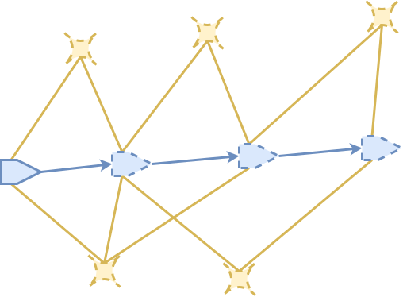
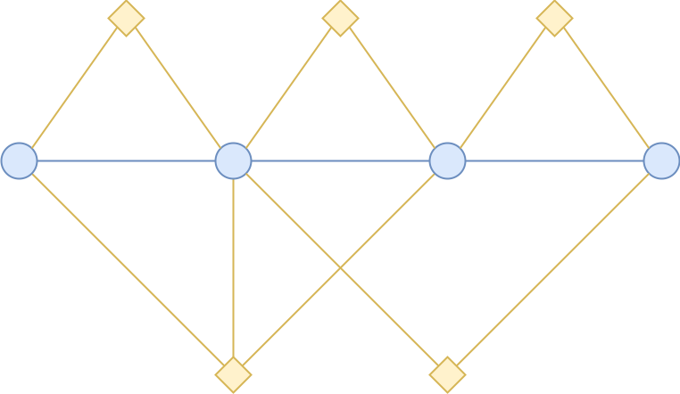
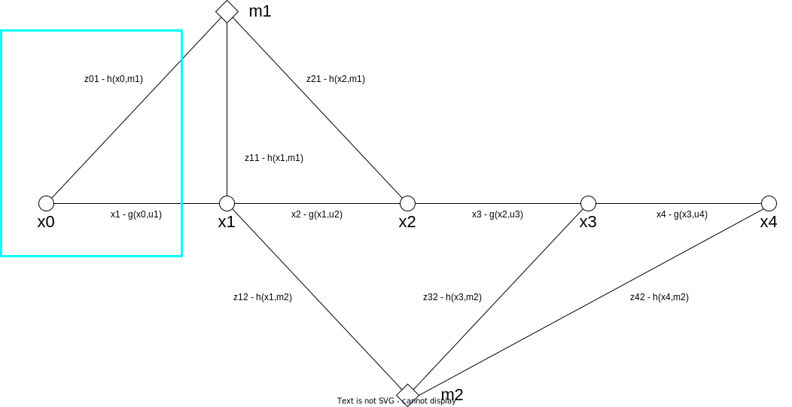

Graph SLAMの導出
================

Graph SLAMとは
--------------

Graph SLAMとは、SLAMの最適化問題をグラフ構造で表現する手法である。

.. _motion-and-observation:

   SLAMは周囲の観測情報(橙色)と運動情報(青色)を用いてセンサ姿勢を推定する。

センサ姿勢をノードで表現すると、異なる2時刻間の姿勢関係をそれらノードをつなぐエッジで表現することができる。ランドマークも同様にノードで表現することができる。これにより、ランドマークとセンサ姿勢の関係をこれらをつなぐエッジで表現することができる。
たとえば :numref:`motion-and-observation` におけるセンサとランドマークの関係をグラフで表現すると :numref:`homeomorphic-graph` のようになる。

.. _homeomorphic-graph:

    :numref:`motion-and-observation` におけるセンサとランドマークの関係をグラフで表現したもの

今回は運動センサとしてIMUを、観測センサとしてカメラを用いることとし、Graph SLAMを確率モデルから導出する。

SLAMの確率モデルによる表現
~~~~~~~~~~~~~~~~~~~~~~~~~~

| まずはSLAMの問題を確率モデルで表現することから始める。
| 初期時刻 :math:`0` から :math:`T` までの姿勢を :math:`\mathbf{x}_{0:T} = \{\mathbf{x}_{1},...,\mathbf{x}_{T}\}` 、 :math:`\mathbf{x}_{0:T}` から観測されたランドマークの集合を :math:`M_{0:T} = \{\mathbf{m}_{1},...,\mathbf{m}_{N_{T}}\}` とする。
| 時刻 :math:`0` から :math:`T` の間に得られたIMU観測値の集合を :math:`\mathbf{u}_{1:T} = \{\mathbf{u}_{1},...,\mathbf{u}_{T}\}` とする。たとえば :math:`\mathbf{u}_{1}` は時刻 :math:`0` から :math:`1` の間に得られたIMU観測値を表している。
| ランドマーク観測値の集合を :math:`Z_{0:T} = \{\mathbf{z}_{ij} \;|\; (i, j) \in S_{0:T}\}` とする。ここで :math:`S_{0:T}` は時刻 :math:`0` から時刻 :math:`T` までのセンサ姿勢とそこから観測可能なランドマークの組み合わせを表している。
| 我々の目的は、次の分布を明らかにすることである。

.. math::
    p(\mathbf{x}_{0:T}, M_{0:T}\;|\;\mathbf{u}_{1:T}, Z_{0:T})
    :label: fullslamposterior

| すなわち、IMUやカメラから得られた観測情報を用いて、時刻 :math:`0` から :math:`T` までの姿勢およびその間に観測されたランドマークの分布を求めるという問題である。

状態分布の再帰的推定法の導出
~~~~~~~~~~~~~~~~~~~~~~~~~~~~

SLAMは高速に動作することが求められるため、ある事前情報をたよりにして特定時刻の状態を求めることが一般的である。ここでは時刻 :math:`T-1` の状態をたよりにして時刻 :math:`T` の状態を求める確率モデルを導出する。

| まずはベイズの定理に従って :eq:`fullslamposterior` を分解する。

.. math::
   &p(\mathbf{x}_{0:T}, M_{0:T}\;|\;\mathbf{u}_{1:T}, Z_{0:T}) \\
   &= \eta_{T} \; p(Z_{T}\;|\;\mathbf{x}_{0:T},M_{0:T},\mathbf{u}_{1:N},Z_{0:T-1})\;p(\mathbf{x}_{0:T},M_{0:T}\;|\;\mathbf{u}_{1:T},Z_{0:T-1}) \\
   :label: factored-posterior

| :math:`Z_{T}` は時刻 :math:`T` に観測できるランドマークの集合である。
| :math:`\eta_{T}` は次で計算される定数である。

.. math::
    \eta_{T} = \frac{p(\mathbf{u}_{1:T},Z_{0:T-1})}{p(\mathbf{u}_{1:T},Z_{0:T})}

:math:`\eta_{T}` は観測値 :math:`\mathbf{u}_{1:T},Z_{0:T}` の確率分布のみで構成されているため、いったん観測値が得られてしまえば :math:`\eta_{T}` は変化しない。したがって姿勢推定の問題では :math:`\eta_{T}` は定数として扱うことができる。

| :math:`Z_{T}` の分布を見てみよう。:math:`Z_{T}` の分布は時刻 :math:`T` のカメラ姿勢と時刻 :math:`T` に観測できるランドマークの座標にしか依存しない。たとえば、時刻 :math:`T` のカメラ姿勢やそこから観測できるランドマーク位置が変化すれば、カメラに映るランドマークの像 :math:`Z_{T}` は変化する。一方で、時刻 :math:`T` におけるIMU観測値がどうであろうと、その値はカメラに映るランドマークの像になんら直接的変化を及ぼさない。これにより、 :math:`Z_{T}` の確率分布を次のように単純化できる [#simplify_z_distribution]_ 。

.. math::
    p(Z_{T}\;|\;\mathbf{x}_{0:T},M_{0:T},\mathbf{u}_{1:N},Z_{0:T-1}) = p(Z_{T}\;|\;\mathbf{x}_{T},M_{0:T})

:eq:`factored-posterior` のもうひとつの確率についてもベイズ則を適用する。

.. math::
    &p(\mathbf{x}_{0:T},M_{0:T}\;|\;\mathbf{u}_{1:T},Z_{0:T-1}) \\
    &= p(\mathbf{x}_{T}\;|\;\mathbf{x}_{0:T-1},M_{0:T},\mathbf{u}_{1:T},Z_{0:T-1})\;
      p(\mathbf{x}_{0:T-1},M_{0:T}\;|\;\mathbf{u}_{1:T},Z_{0:T-1})

計算の簡略化のため、時刻 :math:`T` の姿勢 :math:`\mathbf{x}_{T}` が1時刻前の姿勢 :math:`\mathbf{x}_{T-1}` と時刻 :math:`T-1` から :math:`T` までに得られるIMU観測値 :math:`\mathbf{u}_{T}` のみを用いて予測できると仮定する。したがって先ほどと同様の議論により、次のような簡略化を行うことができる。

.. math::
    &p(\mathbf{x}_{0:T},M_{0:T}\;|\;\mathbf{u}_{1:T},Z_{0:T-1}) \\
    &=
    p(\mathbf{x}_{T}\;|\;\mathbf{x}_{0:T-1},M_{0:T},\mathbf{u}_{1:T},Z_{0:T-1})\;
    p(\mathbf{x}_{0:T-1},M_{0:T}\;|\;\mathbf{u}_{1:T},Z_{0:T-1}) \\
    &=
    p(\mathbf{x}_{T}\;|\;\mathbf{x}_{T-1},\mathbf{u}_{T})\;
    p(\mathbf{x}_{0:T-1},M_{0:T}\;|\;\mathbf{u}_{1:T},Z_{0:T-1}) \\

:math:`\mathbf{x}_{T-1}` までの姿勢を予測するためには時刻 :math:`T-1` までのIMU観測値があれば十分なので、 :math:`\mathbf{u}_{T}` を条件から除外することができる。
また、時刻 :math:`0` から :math:`T-1` までに観測できるランドマークの集合は :math:`M_{0:T-1}` なので、これも修正する。

.. math::
    &p(\mathbf{x}_{0:T},M_{0:T}\;|\;\mathbf{u}_{1:T},Z_{0:T-1}) \\
    &=
    p(\mathbf{x}_{T}\;|\;\mathbf{x}_{T-1},\mathbf{u}_{T})\;
    p(\mathbf{x}_{0:T-1},M_{0:T}\;|\;\mathbf{u}_{1:T},Z_{0:T-1}) \\
    &=
    p(\mathbf{x}_{T}\;|\;\mathbf{x}_{T-1},\mathbf{u}_{T})\;
    p(\mathbf{x}_{0:T-1},M_{0:T-1}\;|\;\mathbf{u}_{1:T-1},Z_{0:T-1})

これらを総合して式 :eq:`factored-posterior` を再構成すると、時刻 :math:`T-1` における状態分布から時刻 :math:`T` の状態分布を得る式を導くことができる。

.. math::
   &p(\mathbf{x}_{0:T}, M_{0:T}\;|\;\mathbf{u}_{1:T}, Z_{0:T}) \\
   &= \eta_{T} \; p(Z_{T}\;|\;\mathbf{x}_{0:T},M_{0:T},\mathbf{u}_{1:N},Z_{0:T-1})\;p(\mathbf{x}_{0:T},M_{0:T}\;|\;\mathbf{u}_{1:T},Z_{0:T-1}) \\
   &= \eta_{T} \;
    p(Z_{T}\;|\;\mathbf{x}_{T},M_{0:T}) \;
    p(\mathbf{x}_{T}\;|\;\mathbf{x}_{T-1},\mathbf{u}_{T})\;
    p(\mathbf{x}_{0:T-1},M_{0:T-1}\;|\;\mathbf{u}_{1:T-1},Z_{0:T-1}) \\
   :label: prediction-from-previous

式 :eq:`prediction-from-previous` は時刻 :math:`T` における状態分布 :math:`p(\mathbf{x}_{0:T}, M_{0:T}\;|\;\mathbf{u}_{1:T}, Z_{0:T})` を時刻 :math:`T-1` の状態分布 :math:`p(\mathbf{x}_{0:T-1},M_{0:T-1}\;|\;\mathbf{u}_{1:T-1},Z_{0:T-1})` から推定する方法を示している。これを再帰的に繰り返していくと次のようになる。

.. math::
   \begin{align}
   p(\mathbf{x}_{0:T}, M_{0:T}\;|\;\mathbf{u}_{1:T}, Z_{0:T})
   = \;
    & \eta_{T} \; p(Z_{T}\;|\;\mathbf{x}_{T},M_{0:T}) \; p(\mathbf{x}_{T}\;|\;\mathbf{x}_{T-1},\mathbf{u}_{T}) \; \\
    & ... \\
    & \eta_{2} \; p(Z_{2}\;|\;\mathbf{x}_{2},M_{0:2}) \; p(\mathbf{x}_{2}\;|\;\mathbf{x}_{1},\mathbf{u}_{2}) \; \\
    & \eta_{1} \; p(Z_{1}\;|\;\mathbf{x}_{1},M_{0:1}) \; p(\mathbf{x}_{1}\;|\;\mathbf{x}_{0},\mathbf{u}_{1}) \; p(\mathbf{x}_{0}) \\
   =\;
    &\eta_{1:T} \; p(\mathbf{x}_{0})\; \prod_{i=1}^{T} \left[ p(Z_{i}\;|\;\mathbf{x}_{i},M_{0:i}) \; p(\mathbf{x}_{i}\;|\;\mathbf{x}_{i-1},\mathbf{u}_{i}) \right] \\
    &\text{where}\quad \eta_{1:T} = \prod_{i=1}^{T} \eta_{i}
   \end{align}
   :label: recursive-decomposition

この式では時刻 :math:`0` における姿勢の分布を :math:`p(\mathbf{x}_{0})` としている。一般的に :math:`\mathbf{x}_{0}` は推定するものではなく基準座標として任意に定めるものであるため、このようにおくことができる。

一般的なSLAMの問題では時刻 :math:`i` までに観測されるすべてのランドマーク :math:`M_{0:i}` を時刻 :math:`T` までのすべての姿勢 :math:`\mathbf{x}_{0:i}` から観測できるわけではない。これを踏まえて式 :eq:`recursive-decomposition` をさらに具体的に次のように書くことができる。

.. math::
   &p(\mathbf{x}_{0:T}, M_{0:T}\;|\;\mathbf{u}_{1:T}, Z_{0:T}) \\
   &=
    \eta_{1:T} \; p(\mathbf{x}_{0})\; \prod_{i=1}^{T} \left[ p(Z_{i}\;|\;\mathbf{x}_{i},M_{0:i}) \; p(\mathbf{x}_{i}\;|\;\mathbf{x}_{i-1},\mathbf{u}_{i}) \right] \\
   &=
    \eta_{1:T} \; p(\mathbf{x}_{0})\; \prod_{(i,j)\in S_{0:T}} p(\mathbf{z}_{ij}\;|\;\mathbf{x}_{i},\mathbf{m}_{j}) \prod_{k=1}^{T} p(\mathbf{x}_{k}\;|\;\mathbf{x}_{k-1},\mathbf{u}_{k})
   :label: posterior-decomposition

このようにして、 状態分布を推定する問題を、

1. 各時刻におけるオドメトリ :math:`p(\mathbf{x}_{k}\;|\;\mathbf{x}_{k-1},\mathbf{u}_{k}), k = 1,...,T` を推定する問題
2. 各ランドマークの観測値の分布 :math:`p(\mathbf{z}_{ij}\;|\;\mathbf{x}_{i},\mathbf{m}_{j}),\;(i, j) \in S_{0:T}` を求める問題

に変換することができた。

初期状態分布の記述
~~~~~~~~~~~~~~~~~~

初期姿勢 :math:`\mathbf{x}_{0}` はプログラム上で固定値にすればよいため分布を仮定する必要はないのだが、便宜的に次のように設定しておく。

.. math::
    p(\mathbf{x}_{0}) \propto \exp\{-\frac{1}{2}\left[\mathbf{x}_{0} - \mathbf{0}\right]^{\top} Q_{0}^{-1} \left[\mathbf{x}_{0} - \mathbf{0}\right]\} = \exp(\mathbf{x}_{0}^{\top} Q_{0}^{-1} \mathbf{x}_{0}),\\
   \text{where}\quad Q_{0}^{-1} = \operatorname{diag}(\infty,...,\infty)

これによって初期姿勢が :math:`\mathbf{0}` に拘束される。

観測モデルによる予測
~~~~~~~~~~~~~~~~~~~~

式 :eq:`posterior-decomposition` において、 :math:`p(\mathbf{z}_{ij}\;|\;\mathbf{x}_{i},\mathbf{m}_{j})` は :math:`j` 番目のランドマーク :math:`\mathbf{m}_{j}` を時刻 :math:`i` のカメラに投影することで得られるランドマーク観測値の分布を表現している。ランドマークの観測値と予測とのずれが分散 :math:`R_{ij} \in \mathbb{R}^{2 \times 2}` の正規分布に従うとすると、このずれの分布は

.. math::
    p(\mathbf{z}_{ij} \;|\; \mathbf{x}_{i}, \mathbf{m}_{j}) = \frac{1}{\sqrt{(2\pi)^{2}\det(R_{ij})}}\exp\{-\frac{1}{2}\left[\mathbf{z}_{ij} - \mathbf{h}(\mathbf{x}_{i},\mathbf{m}_{j})\right]^{\top}R_{ij}^{-1}\left[\mathbf{z}_{ij} - \mathbf{h}(\mathbf{x}_{i},\mathbf{m}_{j})\right]\}

と書くことができる。

なお、共分散 :math:`Q_{k}` および :math:`R_{ij}` はハイパーパラメータとして与えることもできるが、統計的に計算することも可能である。

運動モデルによる予測
~~~~~~~~~~~~~~~~~~~~

式 :eq:`posterior-decomposition` において、 :math:`p(\mathbf{x}_{k}\;|\;\mathbf{x}_{k-1},\mathbf{u}_{k})` は、前の時刻の姿勢 :math:`\mathbf{x}_{k-1}` および前の時刻から現在時刻までのIMU観測値 :math:`\mathbf{u}_{k}` に基づいた現在の姿勢の予測を表現している。

時刻 :math:`k` の姿勢 :math:`\mathbf{x}_{k}` に対して運動モデルの予測 :math:`\mathbf{g}(\mathbf{x}_{k-1}, \mathbf{u}_{k})` の誤差が分散 :math:`Q_{k} \in \mathbb{R}^{6 \times 6}` の正規分布に従うとすると、この分布は

.. math::
    p(\mathbf{x}_{k}\;|\;\mathbf{x}_{k-1},\mathbf{u}_{k}) =
    \frac{1}{\sqrt{(2\pi)^{6} \det(Q_{k})}}
    \exp(-\frac{1}{2}
    \left[\mathbf{x}_{k} - \mathbf{g}(\mathbf{x}_{k-1}, \mathbf{u}_{k})\right]^{\top} Q_{k}^{-1} \left[\mathbf{x}_{k} - \mathbf{g}(\mathbf{x}_{k-1}, \mathbf{u}_{k})\right])

と記述することができる。

対数尤度関数
~~~~~~~~~~~~

推定したい状態は確率分布の頂点の値である。

確率分布が最大値をとるということは、そこに真の状態および真のランドマーク位置がある可能性が高いということである。

.. math::
    \underset{\mathbf{x}_{0:T},\,M_{0:T}}{\arg\max} \; p(\mathbf{x}_{0:T}, M_{0:T}\;|\;\mathbf{u}_{1:T}, Z_{0:T}) \\

式 :eq:`posterior-decomposition` は正規分布の積で表される。したがってその対数を計算すると指数部分が外れ、最大確率をとる状態を計算しやすくなる。

.. math::
   &\log p(\mathbf{x}_{0:T}, M_{0:T}\;|\;\mathbf{u}_{1:T}, Z_{0:T}) \\
   =\;
   &\text{constant}
   + \log p(\mathbf{x}_{0})
   + \sum_{(i,j)\in S_{0:T}} \log p(\mathbf{z}_{ij}\;|\;\mathbf{x}_{i},\mathbf{m}_{j})
   + \sum_{k=1}^{T} \log p(\mathbf{x}_{k}\;|\;\mathbf{x}_{k-1},\mathbf{u}_{k}) \\
   =\;
   &\text{constant} \\
   &- \frac{1}{2}\mathbf{x}_{0}^{\top}Q_{0}^{-1}\mathbf{x}_{0} \\
   &- \frac{1}{2} \sum_{(i,j)\in S_{0:T}} \left[\mathbf{z}_{ij} - \mathbf{h}(\mathbf{x}_{i},\mathbf{m}_{j})\right]^{\top}R_{ij}^{-1}\left[\mathbf{z}_{ij} - \mathbf{h}(\mathbf{x}_{i},\mathbf{m}_{j})\right] \\
   &- \frac{1}{2} \sum_{k=1}^{T} \left[\mathbf{x}_{k} - \mathbf{g}(\mathbf{x}_{k-1},\mathbf{u}_{k})\right]^{\top} Q_{k}^{-1} \left[\mathbf{x}_{k} - \mathbf{g}(\mathbf{x}_{k-1},\mathbf{u}_{k})\right] \\

対数関数は単調増加関数なので、もとの確率分布を最大化する状態と、対数関数を適用したあとの確率分布を最大化する状態は等しい。

.. math::
    \underset{\mathbf{x}_{0:T},\,M_{0:T}}{\arg\max} \; p(\mathbf{x}_{0:T}, M_{0:T}\;|\;\mathbf{u}_{1:T}, Z_{0:T})
    &= \underset{\mathbf{x}_{0:T},\,M_{0:T}}{\arg\max} \; \log p(\mathbf{x}_{0:T}, M_{0:T}\;|\;\mathbf{u}_{1:T}, Z_{0:T}) \\

結果として、最大確率をとる状態を求める問題はは次の最小化問題に帰結する。

.. math::
    \underset{\mathbf{x}_{0:T},\,M_{0:T}}{\arg\max} \; p(\mathbf{x}_{0:T}, M_{0:T}\;|\;\mathbf{u}_{1:T}, Z_{0:T})
    &= \underset{\mathbf{x}_{0:T},\,M_{0:T}}{\arg\max} \; -E_{T}(\mathbf{x}_{0:T}, M_{0:T}\;|\;\mathbf{u}_{1:T}, Z_{0:T}) \\
    &= \underset{\mathbf{x}_{0:T},\,M_{0:T}}{\arg\min}\; E_{T}(\mathbf{x}_{0:T}, M_{0:T}\;|\;\mathbf{u}_{1:T}, Z_{0:T}), \\
    \\
    E_{T}(\mathbf{x}_{0:T}, M_{0:T}\;|\;\mathbf{u}_{1:T}, Z_{0:T})
    &= \mathbf{x}_{0}^{\top}Q_{0}^{-1}\mathbf{x}_{0} \\
    &+ \sum_{k=1}^{T} \left[\mathbf{x}_{k} - \mathbf{g}(\mathbf{x}_{k-1},\mathbf{u}_{k})\right]^{\top} Q_{k}^{-1} \left[\mathbf{x}_{k} - \mathbf{g}(\mathbf{x}_{k-1},\mathbf{u}_{k})\right] \\
    &+ \sum_{(i,j)\in S_{0:T}} \left[\mathbf{z}_{ij} - \mathbf{h}(\mathbf{x}_{i},\mathbf{m}_{j})\right]^{\top}R_{ij}^{-1}\left[\mathbf{z}_{ij} - \mathbf{h}(\mathbf{x}_{i},\mathbf{m}_{j})\right] \\
   :label: error-function

誤差関数の最小化
----------------

さて、式 :eq:`error-function` に示す誤差関数は残差 :math:`\mathbf{r}_{T}(\mathbf{x}_{0:T}, M_{0:T}\;|\;\mathbf{u}_{1:T}, Z_{0:T})` および共分散行列 :math:`\Sigma_{T}` を用いて次のように表現することができる。

.. math::
   \mathbf{r}_{T}(\mathbf{x}_{0:T}, M_{0:T}\;|\;\mathbf{u}_{1:T}, Z_{0:T}) =
   \begin{bmatrix}
   \mathbf{x}_{0} \\
   \mathbf{x}_{1} - \mathbf{g}(\mathbf{x}_{0}, \mathbf{u}_{1}) \\
   \vdots \\
   \mathbf{x}_{T} - \mathbf{g}(\mathbf{x}_{T-1}, \mathbf{u}_{T}) \\
   \mathbf{z}_{01} - \mathbf{h}(\mathbf{x}_{0},\mathbf{m}_{1}) \\
   \vdots \\
   \mathbf{z}_{TN} - \mathbf{h}(\mathbf{x}_{T},\mathbf{m}_{N})
   \end{bmatrix}

.. math::
   \Sigma_{T} =
   \begin{bmatrix}
   Q_{0} \\
   & Q_{1} \\
   & & \ddots \\
   & & & Q_{T} \\
   & & & & R_{00} \\
   & & & & & \ddots \\
   & & & & & & R_{TN}
   \end{bmatrix}

.. math::
   E_{T}(\mathbf{x}_{0:T}, M_{0:T}\;|\;\mathbf{u}_{1:T}, Z_{0:T})
   = \mathbf{r}_{T}(\mathbf{x}_{0:T}, M_{0:T}\;|\;\mathbf{u}_{1:T}, Z_{0:T})^{\top} \Sigma_{T}^{-1} \mathbf{r}_{T}(\mathbf{x}_{0:T}, M_{0:T}\;|\;\mathbf{u}_{1:T}, Z_{0:T})

このままでは表記が煩雑なので状態を :math:`\mathbf{y}_{T} = \left[\mathbf{x}_{0:T}^{\top},\; M_{0:T}^{\top}\right]^{\top}` とおいて次のように書くことにしよう。

.. math::
   E_{T}(\mathbf{y}_{T}) = \mathbf{r}_{T}(\mathbf{y}_{T})^{\top} \Sigma_{T}^{-1} \mathbf{r}_{T}(\mathbf{y}_{T})

この誤差関数はGauss-Newton法によって最小化できる。

誤差関数の微分
~~~~~~~~~~~~~~

誤差関数 :math:`E_{T}` を状態 :math:`\mathbf{y}_{T}` で微分すると次のようになる。

.. math::
    J = \frac{\partial E_{T}}{\partial \mathbf{y}_{T}} =
    \begin{bmatrix}
     I          &          &             &             &             &             &             \\
    -G_{0}      & \ddots   &             &             &             &             &             \\
                & \ddots   & I           &             &             &             &             \\
                &          & -G_{T-1}    & I           &             &             &             \\
    -H^{x}_{01} &          &             &             & -H^{m}_{01} &             &             \\
                & \ddots   &             &             &             & \ddots      &             \\
                &          & \ddots      &             &             & \ddots      &             \\
                &          &             & -H^{x}_{TN} &             &             & -H^{m}_{TN} \\
    \end{bmatrix}

ここで :math:`G_{i},\; H^{x}_{ij},\; H^{m}_{ij}` は運動モデルおよび観測モデルのJacobianを表している。

.. math::
    G_{i} = \frac{\partial \mathbf{g}(\mathbf{x}_{i}, \mathbf{u}_{i+1})}{\partial \mathbf{x}_{i}},\;
    H^{x}_{ij} = \frac{\partial \mathbf{h}(\mathbf{x}_{i},\mathbf{m}_{j})}{\partial \mathbf{x}_{i}},\;
    H^{m}_{ij} = \frac{\partial \mathbf{h}(\mathbf{x}_{i},\mathbf{m}_{j})}{\partial \mathbf{m}_{j}}

運動モデルを異なる時刻の姿勢で微分すると :math:`0` になる。

.. math::
    \frac{\partial \mathbf{g}(\mathbf{x}_{i}, \mathbf{u}_{i+1})}{\partial \mathbf{x}_{k}} &= 0 \quad \text{if} \; i \neq k  \\

観測モデルも異なる時刻の姿勢もしくは異なるランドマークで微分すると :math:`0` になる。

.. math::
    \frac{\partial \mathbf{h}(\mathbf{x}_{i},\mathbf{m}_{j})}{\partial \mathbf{x}_{k}} &= 0    \quad \text{if} \; i \neq k  \\
    \frac{\partial \mathbf{h}(\mathbf{x}_{i},\mathbf{m}_{j})}{\partial \mathbf{m}_{j}} &= 0    \quad \text{if} \; j \neq k  \\

したがって行列 :math:`J` は非常にスパースになる。

具体例
~~~~~~

次の例を用いてJacobianの形をより具体的に見てみよう。

| 姿勢を :math:`\mathbf{x}_{0:3} = \{\mathbf{x}_{0},\mathbf{x}_{1},\mathbf{x}_{2},\mathbf{x}_{3}\}` 、 ランドマークを :math:`\mathbf{m}_{1:2} = \{\mathbf{m}_{1},\mathbf{m}_{2}\}` とする。
| また、姿勢 :math:`\mathbf{x}_{0},\mathbf{x}_{1},\mathbf{x}_{2}` からランドマーク :math:`\mathbf{m}_{0}` を、姿勢 :math:`\mathbf{x}_{1},\mathbf{x}_{3}` からランドマーク :math:`\mathbf{m}_{1}` を観測できるものとする。

姿勢とランドマークの関係を図で表すとこのようになる。

.. _examplegraph:

.. figure:: images/example-slam-graph.svg
  :align: center

  姿勢とランドマークの関係を表現した図

|

IMU観測値 :math:`\mathbf{u}_{1:3}` およびランドマークの観測値 :math:`Z_{1:3}` はそれぞれ次のようになる。

.. math::
    \mathbf{u}_{1:3} &= \{\mathbf{u}_{1},\mathbf{u}_{2},\mathbf{u}_{3}\}  \\
    Z_{1:3} &= \{\mathbf{z}_{11},\mathbf{z}_{21},\mathbf{z}_{22},\mathbf{z}_{32},\mathbf{z}_{42}\}

これらをもとに誤差関数を構成しよう。

.. math::
   \mathbf{r}_{3}(\mathbf{y}_{3}) =
   \begin{bmatrix}
        \mathbf{x}_{0} - \mathbf{0} \\
        \mathbf{x}_{1} - \mathbf{g}(\mathbf{x}_{0}, \mathbf{u}_{1}) \\
        \mathbf{x}_{2} - \mathbf{g}(\mathbf{x}_{1}, \mathbf{u}_{2}) \\
        \mathbf{x}_{3} - \mathbf{g}(\mathbf{x}_{2}, \mathbf{u}_{3}) \\
        \mathbf{z}_{01} - \mathbf{h}(\mathbf{x}_{0}, \mathbf{m}_{1}) \\
        \mathbf{z}_{11} - \mathbf{h}(\mathbf{x}_{1}, \mathbf{m}_{1}) \\
        \mathbf{z}_{21} - \mathbf{h}(\mathbf{x}_{2}, \mathbf{m}_{1}) \\
        \mathbf{z}_{12} - \mathbf{h}(\mathbf{x}_{1}, \mathbf{m}_{2}) \\
        \mathbf{z}_{32} - \mathbf{h}(\mathbf{x}_{3}, \mathbf{m}_{2}) \\
    \end{bmatrix} \\

.. math::
   E_{3}(\mathbf{x}_{0:3}, \mathbf{m}_{1:2} \;|\; \mathbf{u}_{1:3}, Z_{1:3})
   = \mathbf{r}_{3}(\mathbf{x}_{0:3}, \mathbf{m}_{1:2})^{\top} \Sigma_{3}^{-1} \mathbf{r}_{3}(\mathbf{x}_{0:3}, \mathbf{m}_{1:2})

状態を :math:`\mathbf{y}_{3} = \left[\mathbf{x}_{0},\mathbf{x}_{1},\mathbf{x}_{2},\mathbf{x}_{3},\mathbf{m}_{1},\mathbf{m}_{2}\right]` とすると誤差関数の微分は次のようになる。

.. math::
   J_{3} = \frac{\partial \mathbf{r}_{3}}{\partial \mathbf{y}_{3}} =
   \begin{bmatrix}
      I         &             &             &             &             &             \\
     -G_{0}     & I           &             &             &             &             \\
                & -G_{1}      & I           &             &             &             \\
                &             & -G_{2}      & I           &             &             \\
    -H^{x}_{01} &             &             &             & -H^{m}_{01} &             \\
                & -H^{x}_{11} &             &             & -H^{m}_{11} &             \\
                &             & -H^{x}_{21} &             & -H^{m}_{21} &             \\
                & -H^{x}_{12} &             &             &             & -H^{m}_{12} \\
                &             &             & -H^{x}_{32} &             & -H^{m}_{32} \\
   \end{bmatrix}
   :label: jacobian-j4

Gauss-Newton法による誤差最小化
~~~~~~~~~~~~~~~~~~~~~~~~~~~~~~

| 具体的な最小化の式を見る前に、Gauss-Newton法について解説しよう。Gauss-Newton法は最小化問題の近似式を繰り返し最小化することで解を得る手法である。
| ある値で誤差関数を二次近似し、その最小値を求める。今度はその最小値を用いて誤差関数を二次近似し、得られた近似式の最小値を求める。これを繰り返すことで誤差関数を最小化する状態を求める。

誤差関数 :math:`E_{T}(\mathbf{y}_{T}) = \mathbf{r}_{T}(\mathbf{y}_{T})^{\top} \Sigma_{T}^{-1} \mathbf{r}_{T}(\mathbf{y}_{T})` を最小化する問題を考えよう。

Gauss-Newton法ではまず初期値 :math:`\mathbf{y}_{T}^{(0)}` を定め、そのまわりで誤差関数 :math:`E_{T}` を最小化する状態 :math:`\Delta \mathbf{y}_{T}^{(0)}` を求める。

.. math::
   E_{T}(\mathbf{y}_{T}^{(0)} + \Delta \mathbf{y}_{T}^{(0)}) =
   \mathbf{r}_{T}(\mathbf{y}_{T}^{(0)} + \Delta \mathbf{y}_{T}^{(0)})^{\top} \Sigma_{T}^{-1} \mathbf{r}_{T}(\mathbf{y}_{T}^{(0)} + \Delta \mathbf{y}_{T}^{(0)})

| この問題は解析的に解けないため、誤差関数を近似し、それを最小化する状態 :math:`\mathbf{y}_{T}^{(0)} + \Delta \mathbf{y}_{T}^{(0)}` を求める。
| まずは残差 :math:`\mathbf{r}_{T}` を近似する。

.. math::
   \mathbf{r}_{T}(\mathbf{y}_{T}^{(0)} + \Delta \mathbf{y}_{T}^{(0)})
   &\approx \mathbf{r}_{T}(\mathbf{y}_{T}^{(0)}) + \left. \frac{\partial \mathbf{r}_{T}}{\partial \mathbf{y}_{T}}\right|_{\mathbf{y}_{T}^{(0)}} \Delta \mathbf{y}_{T}^{(0)}\\
   &= \mathbf{r}_{T}(\mathbf{y}_{T}^{(0)}) + J_{T}^{(0)} \Delta \mathbf{y}_{T}^{(0)},
   \quad J_{T}^{(0)} = \left. \frac{\partial \mathbf{r}_{T}}{\partial \mathbf{y}_{T}}\right|_{\mathbf{y}_{T}^{(0)}}

これを用いて誤差関数 :math:`E_{T}` を近似し、 :math:`\tilde{E}_{T}^{(0)}` とおく。

.. math::
   &\tilde{E}_{T}^{(0)}(\Delta \mathbf{y}_{T}^{(0)}) \\
   &:= \left[ \mathbf{r}_{T}(\mathbf{y}_{T}^{(0)}) + J_{T}^{(0)} \Delta \mathbf{y}_{T}^{(0)} \right]^{\top}
   \Sigma_{T}^{-1}
   \left[ \mathbf{r}_{T}(\mathbf{y}_{T}^{(0)}) + J_{T}^{(0)} \Delta \mathbf{y}_{T}^{(0)} \right] \\
   &= \mathbf{r}_{T}(\mathbf{y}_{T}^{(0)})^{\top} \Sigma_{T}^{-1} \mathbf{r}_{T}(\mathbf{y}_{T}^{(0)})
   + 2 \Delta {\mathbf{y}_{T}^{(0)}}^{\top} {J_{T}^{(0)}}^{\top} \Sigma_{T}^{-1} \mathbf{r}_{T}(\mathbf{y}_{T}^{(0)})
   + \Delta {\mathbf{y}_{T}^{(0)}}^{\top} {J_{T}^{(0)}}^{\top} \Sigma_{T}^{-1} J_{T}^{(0)} \Delta \mathbf{y}_{T}^{(0)}

誤差関数の近似結果 :math:`\tilde{E}_{T}^{(0)}` を最小化する状態ステップ幅 :math:`\mathbf{y}_{T}^{(0)}` を求めるには、 :math:`\tilde{E}_{T}^{(0)}` を微分し、それを :math:`\mathbf{0}` とおけばよい。

.. math::
   \frac{\partial \tilde{E}_{T}^{(0)}}{\partial \Delta \mathbf{y}_{T}^{(0)}}
   = 2 {J_{T}^{(0)}}^{\top} \Sigma_{T}^{-1} \mathbf{r}_{T}(\mathbf{y}_{T}^{(0)}) + 2 {J_{T}^{(0)}}^{\top} \Sigma_{T}^{-1} J_{T}^{(0)} \Delta \mathbf{y}_{T}^{(0)}
   = \mathbf{0}

したがって、近似結果 :math:`\tilde{E}_{T}^{(0)}` を最小化するステップ幅 :math:`\Delta \mathbf{y}_{T}^{(0)}` は次の式で得られる。

.. math::
   \Delta \mathbf{y}_{T}^{(0)} = - \left({J_{T}^{(0)}}^{\top} \Sigma_{T}^{-1} J_{T}^{(0)}\right)^{-1} {J_{T}^{(0)}}^{\top} \Sigma_{T}^{-1} \mathbf{r}_{T}(\mathbf{y}_{T}^{(0)})
   :label: gauss-newton-update

さて、 :math:`\tilde{E}_{T}^{(0)}` はあくまでもとの誤差関数 :math:`E_{T}` の近似式なので :math:`\mathbf{y}_{T}^{(0)} + \Delta \mathbf{y}_{T}^{(0)}` はもとの誤差関数 :math:`E_{T}` を最小化する値ではない。しかし近似が十分に優れているならば、 :math:`E_{T}(\mathbf{y}_{T}^{(0)} + \Delta \mathbf{y}_{T}^{(0)}) < E_{T}(\mathbf{y}_{T}^{(0)})` となっているはずである。したがって、次は :math:`\mathbf{y}_{T}^{(1)} = \mathbf{y}_{T}^{(0)} + \Delta \mathbf{y}_{T}^{(0)}` とし、 :math:`\mathbf{y}_{T}^{(1)}` のまわりで誤差関数 :math:`E_{T}` を近似し、それを最小化するステップ幅 :math:`\Delta \mathbf{y}_{T}^{(1)}` を求める。Gauss-Newton法は誤差関数の変化が収束するまでこの操作を繰り返し、誤差関数 :math:`E_{T}` を最小化する状態の値を求める。

なお、 :math:`{J_{T}^{(0)}}^{\top} \Sigma_{T}^{-1} J_{T}^{(0)}` の部分は残差 :math:`\mathbf{r}_{T}` のヘッシアンを近似したものである。今後はこれを単にヘッシアンと呼ぶことにする。このヘッシアンの構造が Graph SLAM の性能に大きく影響してくる。

Gauss-Newton法による状態推定の手順をまとめると次のようになる。

1. 初期値 :math:`\mathbf{y}_{T}^{(0)}` を定める
2. :math:`\mathbf{y}_{T}^{(0)}` のまわりで残差 :math:`\mathbf{r}_{T}` を近似し、 :math:`J_{T}^{(0)}` を求める
3. ステップ幅 :math:`\Delta \mathbf{y}_{T}^{(0)} = - ({J_{T}^{(0)}}^{\top} \Sigma_{T}^{-1} J_{T}^{(0)})^{-1} {J_{T}^{(0)}}^{\top} \Sigma_{T}^{-1} \mathbf{r}_{T}(\mathbf{y}_{T}^{(0)})` を求める
4. ステップ幅を用いて状態を更新する :math:`\mathbf{y}_{T}^{(1)} = \mathbf{y}_{T}^{(0)} + \Delta \mathbf{y}_{T}^{(0)}`
5. 更新された状態を用いてステップ2以降を繰り返す

ヘッシアンの構造
~~~~~~~~~~~~~~~~

SLAMのヘッシアンは要素の有無がグラフの隣接関係に対応するという面白い構造を持っている。なにを言っているのかよくわからないと思うので、式 :eq:`jacobian-j4` を例として実際にヘッシアンを計算してみよう。

..
   &=
   \begin{bmatrix}
      I         & -G_{0}^{\top} &               &               & -{H^{x}_{01}}^{\top} &                      &                      &                      &                      \\
                & I             & -G_{1}^{\top} &               &                      & -{H^{x}_{11}}^{\top} &                      & -{H^{x}_{12}}^{\top} &                      \\
                &               & I             & -G_{2}^{\top} &                      &                      & -{H^{x}_{21}}^{\top} &                      &                      \\
                &               &               & I             &                      &                      &                      &                      & -{H^{x}_{32}}^{\top} \\
                &               &               &               & -{H^{m}_{01}}^{\top} & -{H^{m}_{11}}^{\top} & -{H^{m}_{21}}^{\top} &                      &                      \\
                &               &               &               &                      &                      &                      & -{H^{m}_{12}}^{\top} & -{H^{m}_{32}}^{\top} \\
   \end{bmatrix}
   \begin{bmatrix}
     Q_{0}^{-1}            &                        &                        &                        &                        &             \\
     -Q_{1}^{-1}G_{0}      & Q_{1}^{-1}             &                        &                        &                        &             \\
                           & -Q_{2}^{-1}G_{1}       & Q_{2}^{-1}             &                        &                        &             \\
                           &                        & -Q_{3}^{-1}G_{2}       & Q_{3}^{-1}             &                        &             \\
    -R_{01}^{-1}H^{x}_{01} &                        &                        &                        & -R_{01}^{-1}H^{m}_{01} &             \\
                           & -R_{11}^{-1}H^{x}_{11} &                        &                        & -R_{11}^{-1}H^{m}_{11} &             \\
                           &                        & -R_{21}^{-1}H^{x}_{21} &                        & -R_{21}^{-1}H^{m}_{21} &             \\
                           & -R_{12}^{-1}H^{x}_{12} &                        &                        &                        & -R_{12}^{-1}H^{m}_{12} \\
                           &                        &                        & -R_{32}^{-1}H^{x}_{32} &                        & -R_{32}^{-1}H^{m}_{32} \\
   \end{bmatrix}
   \\

..
   &=
   \begin{bmatrix}
      I         & -G_{0}^{\top} &               &               & -{H^{x}_{01}}^{\top} &                      &                      &                      &                      \\
                & I             & -G_{1}^{\top} &               &                      & -{H^{x}_{11}}^{\top} &                      & -{H^{x}_{12}}^{\top} &                      \\
                &               & I             & -G_{2}^{\top} &                      &                      & -{H^{x}_{21}}^{\top} &                      &                      \\
                &               &               & I             &                      &                      &                      &                      & -{H^{x}_{32}}^{\top} \\
                &               &               &               & -{H^{m}_{01}}^{\top} & -{H^{m}_{11}}^{\top} & -{H^{m}_{21}}^{\top} &                      &                      \\
                &               &               &               &                      &                      &                      & -{H^{m}_{12}}^{\top} & -{H^{m}_{32}}^{\top} \\
   \end{bmatrix}
   \begin{bmatrix}
      Q_{0}^{-1} &            &            &            &             &             &             &             \\
                 & Q_{1}^{-1} &            &            &             &             &             &             \\
                 &            & Q_{2}^{-1} &            &             &             &             &             \\
                 &            &            & Q_{3}^{-1} &             &             &             &             \\
                 &            &            &            & R_{01}^{-1} &             &             &             \\
                 &            &            &            &             & R_{11}^{-1} &             &             &             \\
                 &            &            &            &             &             & R_{21}^{-1} &             &             \\
                 &            &            &            &             &             &             & R_{12}^{-1} &             \\
                 &            &            &            &             &             &             &             & R_{32}^{-1} \\
   \end{bmatrix}
   \begin{bmatrix}
      I         &             &             &             &             &             \\
     -G_{0}     & I           &             &             &             &             \\
                & -G_{1}      & I           &             &             &             \\
                &             & -G_{2}      & I           &             &             \\
    -H^{x}_{01} &             &             &             & -H^{m}_{01} &             \\
                & -H^{x}_{11} &             &             & -H^{m}_{11} &             \\
                &             & -H^{x}_{21} &             & -H^{m}_{21} &             \\
                & -H^{x}_{12} &             &             &             & -H^{m}_{12} \\
                &             &             & -H^{x}_{32} &             & -H^{m}_{32} \\
   \end{bmatrix}

.. math::
   &J_{3}^{\top} \Sigma_{3}^{-1} J_{3} \\
   &=
   \begin{bmatrix}
   D_{0}                                    & -G_{0}^{\top}Q_{1}^{-1}                  &                                          &                                          & {H^{x}_{01}}^{\top}R_{01}^{-1}H^{m}_{01} &                                          \\
   -Q_{1}^{-1}G_{0}                         & D_{1}                                    & -G_{1}^{\top}Q_{2}^{-1}                  &                                          & {H^{x}_{11}}^{\top}R_{11}^{-1}H^{m}_{11} & {H^{x}_{12}}^{\top}R_{12}^{-1}H^{m}_{12} \\
                                            & -Q_{2}^{-1}G_{1}                         & D_{2}                                    & -G_{2}^{\top}Q_{3}^{-1}                  & {H^{x}_{21}}^{\top}R_{21}^{-1}H^{m}_{21} &                                          \\
                                            &                                          & -Q_{3}^{-1}G_{2}                         & D_{3}                                    &                                          & {H^{x}_{32}}^{\top}R_{32}^{-1}H^{m}_{32} \\
   {H^{m}_{01}}^{\top}R_{01}^{-1}H^{x}_{01} & {H^{m}_{11}}^{\top}R_{11}^{-1}H^{x}_{11} & {H^{m}_{21}}^{\top}R_{21}^{-1}H^{x}_{21} &                                          & D_{4}                                    &                                          \\
                                            & {H^{m}_{12}}^{\top}R_{12}^{-1}H^{x}_{12} &                                          & {H^{m}_{32}}^{\top}R_{32}^{-1}H^{x}_{32} &                                          & D_{5}                                    \\
   \end{bmatrix} \\
   \\
   &\text{where} \\
   &D_{0} = Q_{0}^{-1} + G_{0}^{\top}Q_{1}^{-1}G_{0} + {H^{x}_{01}}^{\top}R_{01}^{-1}{H^{x}_{01}} \\
   &D_{1} = Q_{1}^{-1} + G_{1}^{\top}Q_{2}^{-1}G_{1} + {H^{x}_{11}}^{\top}R_{11}^{-1}H^{x}_{11} + {H^{x}_{12}}^{\top}R_{12}^{-1}H^{x}_{12} \\
   &D_{2} = Q_{2}^{-1} + G_{2}^{\top}Q_{3}^{-1}G_{2} + {H^{x}_{21}}^{\top}R_{21}^{-1}H^{x}_{21} \\
   &D_{3} = Q_{3}^{-1} + {H^{x}_{32}}^{\top}R_{32}^{-1}H^{x}_{32} \\
   &D_{4} = {H^{m}_{01}}^{\top}R_{01}^{-1}H^{m}_{01} + {H^{m}_{11}}^{\top}R_{11}^{-1}H^{m}_{11} + {H^{m}_{21}}^{\top}R_{21}^{-1}H^{m}_{21} \\
   &D_{5} = {H^{m}_{12}}^{\top}R_{12}^{-1}H^{m}_{12} + {H^{m}_{32}}^{\top}R_{32}^{-1}H^{m}_{32} \\

ヘッシアンの各行および各列には状態が対応する。たとえばヘッシアンの5行目のブロックは状態ベクトル :math:`\mathbf{y}_{3} = \left[\mathbf{x}_{0},\mathbf{x}_{1},\mathbf{x}_{2},\mathbf{x}_{3},\mathbf{m}_{1},\mathbf{m}_{2}\right]` の5つめの要素 :math:`\mathbf{m}_{1}` に対応する。ヘッシアンの2行目のブロックは状態ベクトルの2番目の要素 :math:`\mathbf{x}_{1}` に対応する。すると、 :numref:`examplegraph` のうち、接続していないノードに対応するヘッシアンの要素はゼロであり、接続しているノードに対応するヘッシアンの要素は非ゼロになっていることがおわかりいただけるだろうか。たとえば、状態ベクトルの2番目の要素である :math:`\mathbf{x}_{1}` からは状態ベクトルの5番目の要素である :math:`\mathbf{m}_{1}` が観測できるため、ヘッシアンの2行5列ブロックの要素および5行2列ブロックの要素は非ゼロである。状態ベクトルの3番目の要素である :math:`\mathbf{x}_{2}` からは状態ベクトルの6番目の要素である :math:`\mathbf{m}_{2}` が観測できないため、ヘッシアンの3行6列ブロックの要素および6行3列ブロックの要素はゼロである。すなわち、ヘッシアンの構造は :numref:`examplegraph` のグラフの隣接行列に対応している。

Sliding window
~~~~~~~~~~~~~~

さて、時刻が進むにつれて推定対象となる姿勢は増えていく。また新規にランドマークを観測するため、より多くのランドマークの位置を推定しなければならない。一方で、姿勢やランドマークが増えすぎるとその推定にかかる計算量が急速に増大してしまう。
計算量の増大を防ぐため、多くのSLAMでは Sliding Window という方式がとられる。これは、状態に対して1時刻ぶんの姿勢およびそこから観測されるランドマークを追加すると同時に、状態から最も古い姿勢および不必要なランドマークを除去することで、計算量の増大を防ごうというものである。
ここではノードの追加と、推定結果全体の整合性を保ったままノードを除去する方法 "Marginalization" を解説する。

Marginalization の目的
----------------------

さて、時刻 :math:`T` で姿勢およびランドマークの推定が終了したとしよう。次の時刻 :math:`T+1` では、姿勢 :math:`\mathbf{x}_{T+1}` および新たに観測されたランドマーク :math:`M_{T+1} = \{\mathbf{m}_{j} | (T+1, j)\in S_{T+1}\}` を誤差関数に追加し、それを最適化することで最適な姿勢 :math:`\mathbf{x}_{0},...,\mathbf{x}_{T+1}` を求めることができる。
しかしこれには問題がある。時刻 :math:`T+1,T+2,\;`T+3,\;...` と姿勢やランドマークを追加していけば、計算量が増大してしまい、高速に姿勢およびランドマーク座標を推定することができなくなってしまう。SLAMは一般的に低消費電力のデバイスで高速に動作することが求められるため、計算量の増加は致命的である。
計算量の増大を抑えるため、1時刻ぶんの姿勢およびランドマークを新規に追加するごとに、1時刻ぶんの古い姿勢と不必要なランドマークを削除する必要がある。このように、1時刻ごとに姿勢やランドマークの追加および削除を行う手法を Sliding Window と呼ぶ。

このあと詳しく解説するが、グラフからノード(姿勢やランドマーク)を単純に削除して残ったグラフのみを最適化すると、時刻 :math:`0` から最新の時刻までの最適化を行うという問題の形式が破綻してしまう。時刻 :math:`0` から最新の時刻までの状態を最適化するという問題の形式を保ったまま Window 内にあるノードを最適する手法を Marginalization と呼ぶ。

Marginalization の効果
----------------------

この問題を解消するために行うのが Marginalization というテクニックである。Marginalization は、古くなった姿勢やランドマークを最適化問題から除去するテクニックであり、次の効果がある。

1. 古くなったランドマークを最適化問題から削除することで計算量の増大を抑えることができる
2. 古くなったノードを除去しつつも、時刻 `0` から最新時刻までの全体の姿勢およびランドマークの最適化を行うという問題の整合性を保ち続けることができる

Marginalization の手法
----------------------

Marginalizationは次のような手法である。

まず前提として時刻 :math:`T` までの最適化問題は解かれているものとする。すなわち :math:`p(\mathbf{x}_{0:T}, M_{0:T} | \mathbf{u}_{1:T}, Z_{0:T})` の :math:`\mathbf{x}_{0:T},\,M_{0:T}` についての最大化がされている(等価な問題である誤差関数 :math:`E_{T}` の最小化が済んでいる)ものとする。

時刻 :math:`T+1` において姿勢とそこから観測されたランドマークが追加される。したがって最適化問題は次のようになる。

..
   TODO ランドマーク数が増えているためNではない

.. math::
    \underset{\mathbf{x}_{0:T+1},\,M_{0:T+1}}{\arg \max} \; p(\mathbf{x}_{0:T+1}, M_{0:T+1} | \mathbf{u}_{1:T+1}, Z_{0:T+1})

さて、このまま時刻が進むにつれて姿勢とランドマークを最適化問題に追加していくと計算コストが一気に増大してしまう。そこで、Gauss-Newton法での更新において古い姿勢およびランドマークを最適化対象から外すことで、計算コストの増大を抑える。これが Marginalization である。

.. _extended-example-graph:

  新たに姿勢が追加されて大きくなったグラフ。青枠部分を更新対象の状態から外す

ここでは例として、 :numref:`examplegraph` のグラフに対し時刻4において新たに姿勢 :math:`\mathbf{x}_{4}` が追加され、 :numref:`extended-example-graph` のようになったとしよう。
状態は :math:`\mathbf{y}_{4} = \left[\mathbf{x}_{0},\mathbf{x}_{1},\mathbf{x}_{2},\mathbf{x}_{3},\mathbf{x}_{4},\mathbf{m}_{1},\mathbf{m}_{2}\right]` となる。

残差 :math:`\mathbf{r}_{4}(\mathbf{y}_{4})` は次のようになる。

.. math::
   \mathbf{r}_{4}(\mathbf{y}_{4}) =
   \begin{bmatrix}
        \mathbf{x}_{0} - \mathbf{0} \\
        \mathbf{x}_{1} - \mathbf{g}(\mathbf{x}_{0}, \mathbf{u}_{1}) \\
        \mathbf{x}_{2} - \mathbf{g}(\mathbf{x}_{1}, \mathbf{u}_{2}) \\
        \mathbf{x}_{3} - \mathbf{g}(\mathbf{x}_{2}, \mathbf{u}_{3}) \\
        \mathbf{x}_{4} - \mathbf{g}(\mathbf{x}_{3}, \mathbf{u}_{4}) \\
        \mathbf{z}_{01} - \mathbf{h}(\mathbf{x}_{0}, \mathbf{m}_{1}) \\
        \mathbf{z}_{11} - \mathbf{h}(\mathbf{x}_{1}, \mathbf{m}_{1}) \\
        \mathbf{z}_{21} - \mathbf{h}(\mathbf{x}_{2}, \mathbf{m}_{1}) \\
        \mathbf{z}_{12} - \mathbf{h}(\mathbf{x}_{1}, \mathbf{m}_{2}) \\
        \mathbf{z}_{32} - \mathbf{h}(\mathbf{x}_{3}, \mathbf{m}_{2}) \\
        \mathbf{z}_{42} - \mathbf{h}(\mathbf{x}_{4}, \mathbf{m}_{2}) \\
    \end{bmatrix} \\

このまま誤差関数を構成して最適化を行うと :math:`\mathbf{x}_{4}` が追加されたぶん計算量が増えてしまうので、marginalization により :math:`\mathbf{x}_{0}` を更新対象から外す。

1. 状態ベクトルと誤差関数の並べ替え
~~~~~~~~~~~~~~~~~~~~~~~~~~~~~~~~~~~

Marginalization を行う際は、状態ベクトル :math:`\mathbf{y}_{4}` のうち、更新対象から外す変数 :math:`\mathbf{x}_{0}` とそれ以外の変数をそれぞれまとめる必要がある。まとめる操作を行ったベクトルを :math:`\mathbf{y}^{\times}_{4}` としよう。今回は :math:`\mathbf{x}_{0}` を更新対象から外すため、 :math:`\mathbf{y}^{\times}_{4}` は次のようになる。

.. math::
   \mathbf{y}^{\times}_{4} &= \left[\mathbf{y}^{m}_{4}, \mathbf{y}^{r}_{4}\right] \\
   \mathbf{y}^{m}_{4} &= \mathbf{x}_{0}  \\
   \mathbf{y}^{r}_{4} &= \left[\mathbf{x}_{1},\mathbf{x}_{2},\mathbf{x}_{3},\mathbf{x}_{4},\mathbf{m}_{1},\mathbf{m}_{2}\right] \\

もともと :math:`\mathbf{x}_{0}` が :math:`\mathbf{y}_{4}` の先頭にあるので上記の例では :math:`\mathbf{y}^{\times}_{4} = \mathbf{y}_{4}` となっているが、もしたとえば :math:`\mathbf{x}_{0}` とともに :math:`\mathbf{m}_{1}` も更新対象から外すのであれば、 :math:`\mathbf{y}^{\times}_{4}` は次のようになる。

.. math::
   \mathbf{y}^{\times}_{4} &= \left[\mathbf{y}^{m}_{4}, \mathbf{y}^{r}_{4}\right] \\
   \mathbf{y}^{m}_{4} &= \left[\mathbf{x}_{0},\mathbf{m}_{1}\right]  \\
   \mathbf{y}^{r}_{4} &= \left[\mathbf{x}_{1},\mathbf{x}_{2},\mathbf{x}_{3},\mathbf{x}_{4},\mathbf{m}_{2}\right] \\

この場合は変数の並べ替えが必要になるため、 :math:`\mathbf{y}^{\times}_{4} \neq \mathbf{y}_{4}` である。

2. Gauss-Newton更新式の計算
~~~~~~~~~~~~~~~~~~~~~~~~~~~

さて、並べ替えられた誤差関数 :math:`\mathbf{y}^{\times}_{4}` を用いてGauss-Newton法の更新式を計算してみよう。

まず Jacobian を計算する。

.. math::
   J^{\times}_{4}
   = \frac{\partial \mathbf{r}_{4}}{\partial \mathbf{y}^{\times}_{4}}
   = \frac{\partial \mathbf{r}_{4}}{\partial \left[\mathbf{y}^{m}_{4}, \mathbf{y}^{r}_{4}\right]}
   =
   \begin{bmatrix}
    \frac{\partial \mathbf{r}_{4}}{\partial \mathbf{y}^{m}_{4}} &
    \frac{\partial \mathbf{r}_{4}}{\partial \mathbf{y}^{r}_{4}}
   \end{bmatrix}
   =
   \begin{bmatrix}
       J^{m}_{4} & J^{r}_{4}
   \end{bmatrix}

ヘッシアンを計算してみよう。

.. math::
    {J^{\times}_{4}}^{\top}J^{\times}_{4}
    &=
    \begin{bmatrix}
        {J^{m}_{4}}^{\top} \\
        {J^{r}_{4}}^{\top}
    \end{bmatrix}
    \Sigma_{4}^{-1}
    \begin{bmatrix}
        J^{m}_{4} &
        J^{r}_{4}
    \end{bmatrix} \\
    &=
    \begin{bmatrix}
        {J^{m}_{4}}^{\top}\Sigma_{4}^{-1}J^{m}_{4} & {J^{m}_{4}}^{\top}\Sigma_{4}^{-1}J^{r}_{4} \\
        {J^{r}_{4}}^{\top}\Sigma_{4}^{-1}J^{m}_{4} & {J^{r}_{4}}^{\top}\Sigma_{4}^{-1}J^{r}_{4}
    \end{bmatrix} \\
    &=
    \begin{bmatrix}
        H^{mm}_{4} & H^{mr}_{4} \\
        H^{rm}_{4} & H^{rr}_{4} \\
    \end{bmatrix}

:math:`-{J^{\times}_{4}}^{\top}\Sigma_{4}^{-1}\mathbf{r}_{4}` を計算し、これを :math:`\left[\mathbf{b}^{m}_{4}, \mathbf{b}^{r}_{4}\right]` とおくことにしよう。

.. math::
    -{J^{\times}_{4}}^{\top}\Sigma_{4}^{-1}\mathbf{r}_{4}
    &=
    -
    \begin{bmatrix}
        {J^{m}_{4}}^{\top} \\
        {J^{r}_{4}}^{\top}
    \end{bmatrix}
    \Sigma_{4}^{-1}
    \mathbf{r}_{4} \\
    &=
    \begin{bmatrix}
        -{J^{m}_{4}}^{\top}\Sigma_{4}^{-1}\mathbf{r}_{4} \\
        -{J^{r}_{4}}^{\top}\Sigma_{4}^{-1}\mathbf{r}_{4}
    \end{bmatrix} \\
    &=
    \begin{bmatrix}
        \mathbf{b}^{m}_{4} \\
        \mathbf{b}^{r}_{4}
    \end{bmatrix}

これらを用いると、式 :eq:`gauss-newton-update` により、Gauss-Newton法の更新量 :math:`\left[\Delta \mathbf{y}^{m}_{4}, \Delta \mathbf{y}^{r}_{4} \right]` が計算できる。

.. math::
    \begin{bmatrix}
        H^{mm}_{4} & H^{mr}_{4} \\
        H^{rm}_{4} & H^{rr}_{4} \\
    \end{bmatrix}
    \begin{bmatrix}
        \Delta \mathbf{y}^{m}_{4} \\
        \Delta \mathbf{y}^{r}_{4}
    \end{bmatrix}
    =
    \begin{bmatrix}
        \mathbf{b}^{m}_{4} \\
        \mathbf{b}^{r}_{4}
    \end{bmatrix}

.. math::
    \begin{bmatrix}
        \Delta \mathbf{y}^{m}_{4} \\
        \Delta \mathbf{y}^{r}_{4}
    \end{bmatrix}
    =
    \begin{bmatrix}
        H^{mm}_{4} & H^{mr}_{4} \\
        H^{rm}_{4} & H^{rr}_{4} \\
    \end{bmatrix}^{-1}
    \begin{bmatrix}
        \mathbf{b}^{m}_{4} \\
        \mathbf{b}^{r}_{4}
    \end{bmatrix}

しかし、これでは :math:`\mathbf{y}^{m}_{4} = \mathbf{x}_{0}` を更新対象から外して計算量を削減するという本来の目的を達成できない。

3. Marginalizationによる計算量削減
~~~~~~~~~~~~~~~~~~~~~~~~~~~~~~~~~~

我々はもはや :math:`\mathbf{y}^{m}_{4} = \mathbf{x}^{0}` を更新しない。 :math:`\mathbf{y}^{r}_{4}` さえ更新できればよい。計算量を削減するため、 :math:`\Delta \mathbf{y}^{m}_{4}` を計算することなく、 :math:`\Delta \mathbf{y}^{r}_{4}` のみを得たい。これを実現するにはどうすればよいだろうか。

じつは両辺に

.. math::
    \begin{bmatrix}
        I & 0 \\
        -H^{rm}_{4}{H^{mm}_{4}}^{-1} & I \\
    \end{bmatrix}

という行列をかけると、これを実現できる。実際に計算してみよう。

.. math::
    \begin{bmatrix}
        I & 0 \\
        -H^{rm}_{4}{H^{mm}_{4}}^{-1} & I \\
    \end{bmatrix}
    \begin{bmatrix}
        H^{mm}_{4} & H^{mr}_{4} \\
        H^{rm}_{4} & H^{rr}_{4} \\
    \end{bmatrix}
    \begin{bmatrix}
        \Delta \mathbf{y}^{m}_{4} \\
        \Delta \mathbf{y}^{r}_{4}
    \end{bmatrix}
    &=
    \begin{bmatrix}
        I & 0 \\
        -H^{rm}_{4}{H^{mm}_{4}}^{-1} & I \\
    \end{bmatrix}
    \begin{bmatrix}
        \mathbf{b}^{m}_{4} \\
        \mathbf{b}^{r}_{4}
    \end{bmatrix} \\
    \begin{bmatrix}
        H^{mm}_{4} & H^{mr}_{4} \\
        0 & H^{rr}_{4}-H^{rm}_{4}{H^{mm}_{4}}^{-1}H^{mr}_{4}
    \end{bmatrix}
    \begin{bmatrix}
        \Delta \mathbf{y}^{m}_{4} \\
        \Delta \mathbf{y}^{r}_{4}
    \end{bmatrix}
    &=
    \begin{bmatrix}
        \mathbf{b}^{m}_{4} \\
        \mathbf{b}^{r}_{4}-H^{rm}_{4}{H^{mm}_{4}}^{-1}\mathbf{b}^{m}_{4}
    \end{bmatrix}

計算の結果、2本の式が得られた。

.. math::
    \left[ H^{rr}_{4}-H^{rm}_{4}{H^{mm}_{4}}^{-1}H^{mr}_{4} \right] \Delta \mathbf{y}^{r}_{4} = \mathbf{b}^{r}_{4} - H^{rm}_{4}{H^{mm}_{4}}^{-1}\mathbf{b}^{m}_{4}
    :label: update-delta-y-r

.. math::
    H^{mm}_{4} \Delta \mathbf{y}^{m}_{4} = \mathbf{b}^{m}_{4} - H^{mr}_{4} \Delta \mathbf{y}^{r}_{4} \\
    :label: update-delta-y-m

式 :eq:`update-delta-y-r` について、 :math:`\tilde{H}_{4}` と :math:`\tilde{\mathbf{b}}_{4}` を次のように定めれば、更新量 :math:`\Delta \mathbf{y}^{r}_{4}` が計算できる。

.. math::
    \tilde{H}_{4} &= H^{rr}_{4}-H^{rm}_{4}{H^{mm}_{4}}^{-1}H^{mr}_{4} \\
    \tilde{\mathbf{b}}_{4} &= \mathbf{b}^{r}_{4} - H^{rm}_{4}{H^{mm}_{4}}^{-1}\mathbf{b}^{m}_{4}

.. math::
    \Delta \mathbf{y}^{r}_{4} = \tilde{H}_{4}^{-1}\tilde{\mathbf{b}}_{4}
    :label: marginalized-update

:math:`\tilde{H}_{4}` と :math:`\tilde{\mathbf{b}}_{4}` のいずれも :math:`\Delta \mathbf{y}^{m}_{4}` に依存しないため、更新式 :eq:`marginalized-update` を用いると :math:`\Delta \mathbf{y}^{m}_{4}` を計算することなく  :math:`\Delta \mathbf{y}^{r}_{4}` を計算することができる。また、 :math:`\tilde{H}_{4}` と :math:`\tilde{\mathbf{b}}_{4}` は :math:`\Delta \mathbf{y}^{r}_{4}` と同じサイズなので、 :math:`\mathbf{y}^{m}_{4} = \mathbf{x}^{0}` を更新対象から外したぶんの計算量が削減できている。

なお、式 :eq:`update-delta-y-m` の両辺に :math:`{H^{mm}_{4}}^{-1}` をかければ :math:`\Delta \mathbf{y}^{m}_{4}` を計算することができるが、 :math:`\mathbf{y}^{m}_{4}` は更新対象から外されているため、 :math:`\Delta \mathbf{y}^{m}_{4}` は計算しなくてよい。

コラム：なぜ marginalization と呼ばれるのか
-------------------------------------------

Marginalization とは日本語で「(確率分布の)周辺化」を意味するのだが、これのいったいどこが周辺化になっているのだろうか。
:math:`\Delta \mathbf{y}^{m}_{4}, \Delta \mathbf{y}^{r}_{4}` を正規分布に従う確率変数とみなすとこの答えが見えてくる。

正規分布の information form による表現
~~~~~~~~~~~~~~~~~~~~~~~~~~~~~~~~~~~~~~

正規分布には information form (もしくは canonical form) と呼ばれる表現方法がある。これは次のようなものである。

変数 :math:`\mathbf{x}` が従う正規分布 :math:`\mathcal{N}(\mathbf{\mu}, \Sigma)` について指数部分に着目し、式を変形していく。

.. math::
    \mathcal{N}(\mathbf{\mu}, \Sigma)
    &\propto \exp(-\frac{1}{2}(\mathbf{x} - \mathbf{\mu})^{\top}\Sigma^{-1}(\mathbf{x} - \mathbf{\mu})) \\
    &= \exp(-\frac{1}{2}\mathbf{x}^{\top}\Sigma^{-1}\mathbf{x} + \mathbf{\mu}^{\top}\Sigma^{-1}\mathbf{x} - \frac{1}{2}\mathbf{\mu}^{\top}\Sigma^{-1}\mathbf{\mu})

:math:`\mathbf{\mu}^{\top}\Sigma^{-1}\mathbf{\mu}` は定数なので比例関係に含めることができる。

.. math::
    \mathcal{N}(\mathbf{x} | \mathbf{\mu}, \Sigma)
    \propto \exp(-\frac{1}{2}\mathbf{x}^{\top}\Sigma^{-1}\mathbf{x} + \mathbf{\mu}^{\top}\Sigma^{-1}\mathbf{x})

:math:`\mathbf{\eta} = \mathbf{\mu}^{\top}\Sigma^{-1}, \Lambda = \Sigma^{-1}` とおけば、全く同じ正規分布を異なるパラメータで表現できる。これが正規分布の information form である。通常これは :math:`\mathcal{N}^{-1}(\mathbf{\eta},  \Lambda)` と表記される。

.. math::
   \mathcal{N}^{-1}(\mathbf{\eta},  \Lambda) \propto \exp(-\frac{1}{2}\mathbf{x}^{\top}\Lambda\mathbf{x} + \mathbf{\eta}^{\top}\mathbf{x})

更新量を確率変数とみなす
~~~~~~~~~~~~~~~~~~~~~~~~

更新量 :math:`\Delta \mathbf{y}^{m}_{4}, \Delta \mathbf{y}^{r}_{4}` を確率変数とみなし、計算に使った行列 :math:`\begin{bmatrix} H^{mm}_{4} & H^{mr}_{4} \\ H^{rm}_{4} & H^{rr}_{4} \end{bmatrix}, \begin{bmatrix} \mathbf{b}^{m}_{4} \\ \mathbf{b}^{r}_{4} \end{bmatrix}` をパラメータとするの正規分布に従うと考える。

.. math::
    \begin{bmatrix}
        \Delta \mathbf{y}^{m}_{4} \\
        \Delta \mathbf{y}^{r}_{4}
    \end{bmatrix} \sim
    \mathcal{N}^{-1}\left(
        \begin{bmatrix}
            \mathbf{b}^{m}_{4} \\
            \mathbf{b}^{r}_{4}
        \end{bmatrix},
        \begin{bmatrix}
            H^{mm}_{4} & H^{mr}_{4} \\
            H^{rm}_{4} & H^{rr}_{4} \\
        \end{bmatrix}
    \right)\\
    :label: canonical-delta-y4-distribution

じつは更新量 :math:`\Delta \mathbf{y}^{m}_{4}, \Delta \mathbf{y}^{r}_{4}` の計算はこの確率の最大化に対応している。実際にやってみよう。

まずは分布を書き下してみる。

.. math::
    &\mathcal{N}^{-1}\left(
        \begin{bmatrix}
            \mathbf{b}^{m}_{4} \\
            \mathbf{b}^{r}_{4}
        \end{bmatrix},
        \begin{bmatrix}
            H^{mm}_{4} & H^{mr}_{4} \\
            H^{rm}_{4} & H^{rr}_{4} \\
        \end{bmatrix}
    \right)\\
    &\propto \exp\left(
    -\frac{1}{2}
    \begin{bmatrix}
        \Delta \mathbf{y}^{m}_{4} \\
        \Delta \mathbf{y}^{r}_{4}
    \end{bmatrix}^{\top}
    \begin{bmatrix}
        H^{mm}_{4} & H^{mr}_{4} \\
        H^{rm}_{4} & H^{rr}_{4} \\
    \end{bmatrix}
    \begin{bmatrix}
        \Delta \mathbf{y}^{m}_{4} \\
        \Delta \mathbf{y}^{r}_{4}
    \end{bmatrix}
    +
    \begin{bmatrix}
        \mathbf{b}^{m}_{4} \\
        \mathbf{b}^{r}_{4}
    \end{bmatrix}^{\top}
    \begin{bmatrix}
        \Delta \mathbf{y}^{m}_{4} \\
        \Delta \mathbf{y}^{r}_{4}
    \end{bmatrix}\right)

指数関数は単調増加なので、指数部分の中身だけに着目すればよい。

.. math::
    &\underset{\Delta \mathbf{y}^{m}_{4}, \Delta \mathbf{y}^{r}_{4}}{\arg \max} \;
    \mathcal{N}^{-1}\left(
        \begin{bmatrix}
            \mathbf{b}^{m}_{4} \\
            \mathbf{b}^{r}_{4}
        \end{bmatrix},
        \begin{bmatrix}
            H^{mm}_{4} & H^{mr}_{4} \\
            H^{rm}_{4} & H^{rr}_{4} \\
        \end{bmatrix}
    \right)\\
    &=
    \underset{\Delta \mathbf{y}^{m}_{4}, \Delta \mathbf{y}^{r}_{4}}{\arg \max}
    \left(
    -\frac{1}{2}
    \begin{bmatrix}
        \Delta \mathbf{y}^{m}_{4} \\
        \Delta \mathbf{y}^{r}_{4}
    \end{bmatrix}^{\top}
    \begin{bmatrix}
        H^{mm}_{4} & H^{mr}_{4} \\
        H^{rm}_{4} & H^{rr}_{4} \\
    \end{bmatrix}
    \begin{bmatrix}
        \Delta \mathbf{y}^{m}_{4} \\
        \Delta \mathbf{y}^{r}_{4}
    \end{bmatrix}
    +
    \begin{bmatrix}
        \mathbf{b}^{m}_{4} \\
        \mathbf{b}^{r}_{4}
    \end{bmatrix}^{\top}
    \begin{bmatrix}
        \Delta \mathbf{y}^{m}_{4} \\
        \Delta \mathbf{y}^{r}_{4}
    \end{bmatrix}\right)

あとは :math:`\left[\Delta \mathbf{y}^{m}_{4}, \Delta \mathbf{y}^{r}_{4}\right]` で微分して :math:`\mathbf{0}` とおけば、確率を最大化する :math:`\left[\Delta \mathbf{y}^{m}_{4}, \Delta \mathbf{y}^{r}_{4}\right]` が得られる。

.. math::
    -
    \begin{bmatrix}
        H^{mm}_{4} & H^{mr}_{4} \\
        H^{rm}_{4} & H^{rr}_{4} \\
    \end{bmatrix}
    \begin{bmatrix}
        \Delta \mathbf{y}^{m}_{4} \\
        \Delta \mathbf{y}^{r}_{4}
    \end{bmatrix}
    +
    \begin{bmatrix}
        \mathbf{b}^{m}_{4} \\
        \mathbf{b}^{r}_{4}
    \end{bmatrix} = \mathbf{0},\\
    \begin{bmatrix}
        \Delta \mathbf{y}^{m}_{4} \\
        \Delta \mathbf{y}^{r}_{4}
    \end{bmatrix}
    =
    \begin{bmatrix}
        H^{mm}_{4} & H^{mr}_{4} \\
        H^{rm}_{4} & H^{rr}_{4} \\
    \end{bmatrix}^{-1}
    \begin{bmatrix}
        \mathbf{b}^{m}_{4} \\
        \mathbf{b}^{r}_{4}
    \end{bmatrix}

Marginalization と Conditioning
~~~~~~~~~~~~~~~~~~~~~~~~~~~~~~~

じつは式 :eq:`canonical-delta-y4-distribution` で示される分布の :math:`\Delta \mathbf{y}^{r}_{4}` についての周辺分布は次の式で表せることが知られている。

.. math::
    \Delta \mathbf{y}^{r}_{4} \sim \mathcal{N}^{-1}\left(
        \mathbf{b}^{r}_{4} - H^{rm}_{4}{H^{mm}_{4}}^{-1}\mathbf{b}^{m}_{4},\;
        H^{rr}_{4}-H^{rm}_{4}{H^{mm}_{4}}^{-1}H^{mr}_{4}
    \right) \\
   :label: marginalized-y-r-4-distribution

さらに、 :math:`\Delta \mathbf{y}^{r}_{4}` で条件づけされた :math:`\Delta \mathbf{y}^{m}_{4}` の分布は次のように表される [#prml-conditional-marginal]_ 。

.. math::
    \Delta \mathbf{y}^{m}_{4} | \Delta \mathbf{y}^{r}_{4} \sim \mathcal{N}^{-1}\left(
        \mathbf{b}^{m}_{4} - H^{mr}_{4} \Delta \mathbf{y}^{r}_{4},\;
        H^{mm}_{4}
    \right)
    :label: conditional-y-m-4-given-y-r-4-distribution

先ほど information form の正規分布のパラメータで線型方程式を作り、それを解くことが確率の最大化に対応することを示した。

式 :eq:`update-delta-y-r` :eq:`update-delta-y-m` を見ると、それぞれ :eq:`marginalized-y-r-4-distribution` :eq:`conditional-y-m-4-given-y-r-4-distribution` で表される分布の最大化に対応していることがおわかりいただけるだろう。

.. [#simplify_z_distribution] もし、たとえば時刻 :math:`T` において1番目と3番目のランドマークしか観測できないのであれば、 :math:`Z_{T} = \{\mathbf{z}_{T1},\mathbf{z}_{T3}\}` は :math:`\mathbf{x}_{T},\mathbf{m}_{1},\mathbf{m}_{3}` にしか依存しないので :math:`p(Z_{T}\;|\;\mathbf{x}_{0:T},M_{0:T},\mathbf{u}_{1:N},Z_{0:T-1}) = p(Z_{T}\;|\;\mathbf{x}_{T},\mathbf{m}_{1},\mathbf{m}_{3})` とするべきであるが、ここでは表記の都合上すべてのランドマークを対象として :math:`M_{0:T}` としている。
.. [#prml-conditional-marginal] Bishop, Christopher M., and Nasser M. Nasrabadi. Pattern recognition and machine learning. Vol. 4. No. 4. New York: springer, 2006. pp. 85-90.
