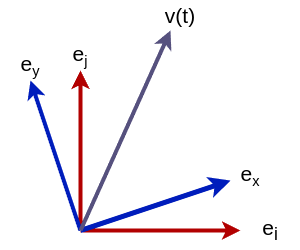

回転座標系上のベクトルの微分
============================

.. math::
   \newcommand{\E}{\mathbf{e}}

   問題の2次元における表現。ベクトル :math:`v(t)` は座標系 :math:`O'(\E_{x}, \E_{y})` の上で回転しており、さらに座標系 :math:`O'(\E_{x}, \E_{y})` そのものが座標系 :math:`O(\E_{i}, \E_{j})` の上で回転している。

原点を共有する2つの座標系 :math:`O(\E_{i}, \E_{j}, \E_{k})` 、 :math:`O'(\E_{x}, \E_{y}, \E_{z})` を考える。前者を固定座標系、後者を回転座標系と呼ぶことにしよう。回転座標系は固定座標系の上で回転しているものとする。

2つの座標系の関係を時刻 :math:`t` によって変化する回転行列 :math:`R(t)` で記述することにしよう。

.. math::
    \begin{bmatrix} \E_{x} & \E_{y} & \E_{z} \end{bmatrix} = R(t)^{\top}\begin{bmatrix} \E_{i} & \E_{j} & \E_{k} \end{bmatrix}
    :label: rotation-between-coordinates

さて、これら2つの座標系の原点が一致していることから、時間変化するベクトル :math:`\mathbf{v}(t) \in \mathrm{R}^{3}` を固定座標系 :math:`O(\E_{i}, \E_{j}, \E_{k})` および回転座標系 :math:`O'(\E_{x}, \E_{y}, \E_{z})` でそれぞれ次のように記述することができる。

.. math::
   \begin{align}
        \mathbf{v}(t)
        &= v_{i}\E_{i} + v_{j}\E_{j} + v_{k}\E_{k}  \\
        &= v_{x}\E_{x} + v_{y}\E_{y} + v_{z}\E_{z}  \\
   \end{align}
   :label: vector-representation

自動車の速度を表すベクトルはこの要件を満たす。車が走っている世界の座標系を :math:`O(\E_{i}, \E_{j}, \E_{k})` 、車体の座標系を :math:`O'(\E_{x}, \E_{y}, \E_{z})` とし、車体の速度ベクトルを :math:`\mathbf{v}` とすれば、式 :eq:`vector-representation` によって車体の速度ベクトルを世界座標系と車体座標系(回転座標系)でそれぞれ表現できる。

固定座標系上での時間微分
------------------------

ベクトル :math:`\mathbf{v}(t)` を固定座標系上で時間微分してみよう。これは固定座標系の基底ベクトル :math:`\E_{i}, \E_{j}, \E_{k}` が固定座標系上で時間変化しないという前提のもとでベクトル :math:`\mathbf{v}(t)` を時間微分することを意味する。

すなわち、 :math:`\frac{d \E_{i}}{d t} = \frac{d \E_{y}}{d t} = \frac{d \E_{y}}{d t} = \mathbf{0}` であることから、ベクトル :math:`\mathbf{v}(t)` の時間微分を固定座標系上で次のように記述することができる。

.. math::
   \frac{d \mathbf{v}(t)}{d t}
   &= \frac{d}{d t}(v_{i}\E_{i} + v_{j}\E_{j} + v_{k}\E_{k}) \\
   &= \frac{d}{d t}(v_{i}\E_{i}) + \frac{d}{d t}(v_{j}\E_{j}) + \frac{d}{d t}(v_{k}\E_{k}) \\
   &= \frac{d v_{i}}{d t}\E_{i} + \frac{d v_{j}}{d t}\E_{j} + \frac{d v_{k}}{d t}\E_{k}
    + v_{i}\frac{d \E_{i}}{d t} + v_{j}\frac{d \E_{j}}{d t} + v_{k}\frac{d \E_{k}}{d t} \\
   &= \frac{d v_{i}}{d t}\E_{i} + \frac{d v_{j}}{d t}\E_{j} + \frac{d v_{k}}{d t}\E_{k}  \\
   &= \begin{bmatrix} \E_{i} & \E_{j} & \E_{k} \end{bmatrix} \begin{bmatrix} \frac{d v_{i}}{dt} \\ \frac{d v_{j}}{dt} \\ \frac{d v_{k}}{dt} \end{bmatrix} \\

固定座標系上のベクトルの固定座標系上での微分を、添字 :math:`W` を用いて

.. math::
   \dot{\mathbf{v}}_{W} = \frac{d v_{i}}{dt}\E_{i} + \frac{d v_{j}}{dt}\E_{j} + \frac{d v_{k}}{dt}\E_{k}

と書くこととすると、

.. math::
   \frac{d \mathbf{v}(t)}{d t} = \dot{\mathbf{v}}_{W}

と表せる。

回転座標系上での時間微分
------------------------

では今度はベクトル :math:`\mathbf{v}(t)` を回転座標系で表現し、それを固定座標系上で時間微分してみよう。回転座標系の基底ベクトル :math:`\E_{x}, \E_{y}, \E_{z}` はいずれも固定座標系上で時間変化する長さ1のベクトルとみなすことができる。

.. math::
   \frac{d \mathbf{v}(t)}{d t}
   &= \frac{d}{d t}(v_{x}\E_{x} + v_{y}\E_{y} + v_{z}\E_{z})  \\
   &= \frac{d v_{x}}{d t}\E_{x} + \frac{d v_{y}}{d t}\E_{y} + \frac{d v_{z}}{d t}\E_{z}
    + v_{x}\frac{d \E_{x}}{d t} + v_{y}\frac{d \E_{y}}{d t} + v_{z}\frac{d \E_{z}}{d t}
   :label: derivative-on-rotation-coordinate

さて、回転座標系の時間微分を具体的に求めてみよう。

式 :eq:`rotation-between-coordinates` の両辺を微分する。

.. math::
    \frac{d}{d t} \begin{bmatrix} \E_{x} & \E_{y} & \E_{z} \end{bmatrix} =
    \frac{d }{d t} \left( R(t)^{\top}\begin{bmatrix} \E_{i} & \E_{j} & \E_{k} \end{bmatrix} \right)

固定座標系が時間変化しないという前提より、固定座標系の微分は式に現れない。

.. math::
    \frac{d}{d t} \begin{bmatrix} \E_{x} & \E_{y} & \E_{z} \end{bmatrix} =
    \frac{d R}{d t}^{\top}\begin{bmatrix} \E_{i} & \E_{j} & \E_{k} \end{bmatrix}
   :label: coordinate-derivative

.. math::
    \def\skew#1{{\left[ #1 \right]_{\times}}}

さて、回転行列の微分は実ベクトル :math:`\mathbf{\omega} \in \mathrm{R}` およびそれに対応する歪対称行列 :math:`\skew{\mathbf{\omega}}` を用いて

.. math::
   \frac{d R}{d t} = -R(t)\skew{\mathbf{\omega}}

| と表すことができる(参照： :doc:`so3`)。
| これを転置すると、 :math:`\skew{\mathbf{\omega}}` が歪対称行列であることから次のように書ける。

.. math::
   \frac{d R}{d t}^{\top} &= -(R(t)\skew{\mathbf{\omega}})^{\top}  \\
                          &= -\skew{\mathbf{\omega}}^{\top}R(t)^{\top}  \\
                          &= \skew{\mathbf{\omega}}R(t)^{\top} \\
   :label: transpose-rotation-derivative

:eq:`transpose-rotation-derivative` を式 :eq:`coordinate-derivative` に代入すると、両辺を回転座標系のみで表現できるようになる。

.. math::
    \frac{d}{d t} \begin{bmatrix} \E_{x} & \E_{y} & \E_{z} \end{bmatrix}
    &= \frac{d R}{d t}^{\top}\begin{bmatrix} \E_{i} & \E_{j} & \E_{k} \end{bmatrix}  \\
    &= \skew{\mathbf{\omega}} R(t)^{\top}\begin{bmatrix} \E_{i} & \E_{j} & \E_{k} \end{bmatrix}  \\
    &= \skew{\mathbf{\omega}} \begin{bmatrix} \E_{x} & \E_{y} & \E_{z} \end{bmatrix}

これを用いれば、式 :eq:`derivative-on-rotation-coordinate` は次のようになる。

.. math::
   \frac{d \mathbf{v}(t)}{d t}
   &= \frac{d v_{x}}{d t}\E_{x} + \frac{d v_{y}}{d t}\E_{y} + \frac{d v_{z}}{d t}\E_{z}
    + v_{x}\frac{d \E_{x}}{d t} + v_{y}\frac{d \E_{y}}{d t} + v_{z}\frac{d \E_{z}}{d t} \\
   &= \begin{bmatrix} \E_{x} & \E_{y} & \E_{z} \end{bmatrix} \begin{bmatrix} \frac{d v_{x}}{dt} \\ \frac{d v_{y}}{dt} \\ \frac{d v_{z}}{dt} \end{bmatrix}
   + \frac{d}{dt} \begin{bmatrix} \E_{x} & \E_{y} & \E_{z} \end{bmatrix} \begin{bmatrix} v_{x} \\ v_{y} \\ v_{z} \end{bmatrix}  \\
   &= \begin{bmatrix} \E_{x} & \E_{y} & \E_{z} \end{bmatrix} \begin{bmatrix} \frac{d v_{x}}{dt} \\ \frac{d v_{y}}{dt} \\ \frac{d v_{z}}{dt} \end{bmatrix}
   + \skew{\mathbf{\omega}} \begin{bmatrix} \E_{x} & \E_{y} & \E_{z} \end{bmatrix} \begin{bmatrix} v_{x} \\ v_{y} \\ v_{z} \end{bmatrix}

回転座標系上のベクトルと、回転座標系上のベクトルの回転座標系上での微分を、添字 :math:`B` を用いてそれぞれ

.. math::
   \mathbf{v}_{B} &= v_{x} \E_{x} + v_{y} \E_{y} + v_{z} \E_{z} \\
   \dot{\mathbf{v}}_{B} &= \frac{d v_{x}}{dt}\E_{x} + \frac{d v_{y}}{dt}\E_{y} + \frac{d v_{z}}{dt}\E_{z} \\

と書くこととすると、 :math:`\frac{d \mathbf{v}(t)}{d t}` は次のように表現できる。

.. math::
   \frac{d \mathbf{v}(t)}{d t} = \dot{\mathbf{v}}_{B} + \skew{\mathbf{\omega}} \mathbf{v}_{B}

座標系ごとの表現の違い
----------------------

まったく同じ :math:`\frac{d \mathbf{v}(t)}{d t}` という値に着目していても、異なる座標系上で議論を行うと、2つの全く異なる表現を得ることになる。

.. math::
   \frac{d \mathbf{v}(t)}{d t} &= \dot{\mathbf{v}}_{W}  \\
   \frac{d \mathbf{v}(t)}{d t} &= \dot{\mathbf{v}}_{B} + \skew{\mathbf{\omega}} \mathbf{v}_{B}  \\

自動車工学などでは、異なる2つの座標系についてどちらかの座標系を基準としてもう片方の座標系が時間変化する事象をよく扱う。異なる2つの座標系で同一のベクトルの微分について論ずる際は、どちらの座標系上での微分について議論を行っているのかを常に意識しなければならない。
